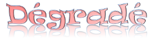

%Langages de balisage légers et logiciels de conversion de documents
%N. Poulain

<!--pandoc-1.9.1.2 --template=NicoTemplate.tex --variable --toc --number-sections --smart --highlight-style=pygments -s comparaison.md -o comparaison.tex && pdflatex comparaison.tex && evince comparaison.pdf -->

Présentation
============

Pour saisir et mettre en forme des textes ou des documents textuels comportant
des insertions d'images, de figures ou de tableaux, on utilise généralement un
traitement de texte WYSIWYG[^1], propriétaire comme Microsoft Word ou libre comme
OpenOffice.

[^1]: Un WYSIWYG pour *What you see is what you get* est une interface
utilisateur qui permet de composer visuellement le résultat voulu. C'est une
interface intuitive : l’utilisateur voit directement à l’écran à quoi
ressemblera le résultat final.

Les défauts majeurs de ces logiciels sont nombreux :

1. Le rédacteur d'un document se concentre presque autant autant sur le fond que
   sur la forme. Outre le temps perdu, les conséquences sur le rendu sont
   nombreuses
	* Les mises en forme les plus hétéroclites sont autorisées au dépens de
	  la lisibilité ;
	* Le résultat final est souvent discutable du point du vue de la
	  typographie car les règles n'en sont pas respectées ni par
	  l'utilisateur ni par le logiciel ;
	* L'utilisation des styles est souvent anarchique et les documents mal
	  structurés, ce qui rend la production automatique de sommaire ou
	  d'index impossible ;
	* L'insertion d'images ou de figures provoque des décalages mal
	  maîtrisés.
1. En ce qui concerne les documents longs, l'inclusion de documents annexes au
   sein du document maître donne des résultats aléatoires ;
1. L'interopérabilité n'est pas assurée entre les logiciels, elle ne l'est pas
   même entre les différentes versions d'un même logiciel, ce qui nous amène au
   dernier point ; 
1. La pérénnité des documents n'est pas certaine puisque la compatibilité
   ascendante ne fonctionne pas toujours et qu'un document écrit il y a quelques
   années risque d'être perdu, faute du logiciel capable de le lire.


À l'opposé de la composition dans un logiciel de traitement de texte, on
peut écrire des documents dans des langages de balisage. Il en existe de
nombreux : LaTeX, HTML, DocBook, etc. Les fichiers sont enregistrés au format
texte brut et doivent être interprétés par un logiciel afin d'être consultés.

En ce qui concerne HTML et LaTeX, où pratiquement toutes les mises en formes
sont possibles, le problème vient de la difficulté à écrire les balises[^2].
Pour écrire un titre suivi d'une phrase contenant un mot en gras puis une liste
non numérotée, on saisira respecivement :

[^2]: Dans le cas du format DocBook, c'est même humainement presque impossible de l'écrire à la main tant l'enchevêtrement des
balises est inextriquable. On le génère avec un logiciel WYSIWYG...

* en LaTeX 

	~~~~
		\section{Le titre du paragraphe}
	 
		Voici un mot en \textbf{gras} puis une liste :
	 
		\begin{enumerate}
		 \item  c'est simple ;
		 \item  c'est efficace.
		\end{enumerate}
	~~~~

* en HTML

	~~~~
		<h1>Le titre du paragraphe</h1>
		<p>Voici un mot en <strong>gras</strong> puis une liste :</p>
		<ul>
		 <li> c'est simple ;</li>
		 <li> c'est efficace.</li>
		</ul>
	~~~~

Comme on le voit, la syntaxe est accessible mais elle nuit à la lisibilité du
texte et au goût de nombreux utilisateurs il y a trop de commandes de mise en
forme.
C'est dommage car ces deux formats ouverts et universels ont chacun leur
avantage :

* HTML peut être lu sur n'importe quelle plateforme ou terminal du monde
  entier car ses spécifications, gérées le W3C[^1], sont respectées par les
  navigateurs web.
* le logiciel LaTeX produit des documents de qualité unanimement
  reconnue. Il prend en charge la mise en page, l'utilisateur n'ayant qu'à se
  concentrer sur le fond et sa structure.

[^1]:Organisme international à but non lucratif

Il existe une alternative qui est à la fois simple, interopérable et efficace :
les langages de balisage légers.

Les langages de balisage légers et les wikis
============================================

Un langage de balisage léger est un langage utilisant une
syntaxe simple, conçue pour qu'un fichier en ce langage soit aisé à saisir avec
un éditeur de texte simple, et facile à lire dans sa forme non formatée.

Les wikis on grandement contribué à populariser ce type de langage. Le principe
est de saisir des balises accessibles aux non inités, un moteur se chargeant de
la conversion en HTML avant la publication.

Re-voici notre exemple, cette fois-ci au format MarkDown :

```markdown
Le titre du paragraphe
======================

Voici un mot en **gras** puis une liste :

* c'est simple ;
* c'est efficace.
```

Avantages :

* les balises sont visuelles et le texte reste lisible ;
* le nombre de balises et de règles est très limité donc
	* la syntaxe est facile à mémoriser ;
	* il est relativement simple de programmer un interpréteur.
* les balises étant constituées de cractères non alphabétiques, on peut utiliser
  un correcteur d'othographe.


Il existe de nombreux langages de balisage légers : Creole, Markdown, Asciidoc,
txt2tags, etc. Chacun a ses avantages, mais tous sont simples.

Les langages de balisage légers et la bureautique
=================================================

On vient de voir qu'au sein des wikis, les langages de balisage légers sont
transformés en HTML. C'est maintenant que les choses
deviennent intéressantes : il existe des logiciels permettant d'exporter et
de mettre en forme vers différents formats pour différents usages : la diffusion
web, bien sûr mais aussi l'export pour un traitement de texte, l'impression, la
lecture sur tablette ou liseuse d'e-book ou encore la vidéo-projection.

Ces logiciels de conversion sont nombreux, nous choisissons ici de parler de
quatre d'entre eux :

* Txt2tags : <http://txt2tags.org/>
* MultiMarkDown :  <http://fletcherpenney.net/multimarkdown/>
* Pandoc : <http://johnmacfarlane.net/pandoc/>
* AsciiDoc : <http://www.methods.co.nz/asciidoc/> 

------------------------------------------------------------
Logiciel  Import    Export   Export       Export   Export
                    web      Bureautique  TeX      LBL[^LBL]
-------   -----     ------   ----------   -----    ---------
Txt2tags  T2t       HTML,    DocBook,     LaTeX    Creole,
                    XHTML,   Lout,                 AsciiDoc,
                    SGML,    MagicPoint,           PmWiki,
                             PageMaker             MoinMoin,
                                                   AsciiDoc,
                                                   DokuWiki

MMD       Markdown  HTML     OpenDocument LaTeX

Pandoc    Markdown, HTML,    OpenDocument,LaTeX,   Markdown,
          LaTeX,    XHTML,   ODT, DOCX,   ConTeXt, RST,
          HTML,     HTML5,   DocBook      Beamer   AsciiDoc,
          Textile,  EPUB,                          Textile,
          RST       Slidy,S5,                      MediaWiki
                    DZSlides

AsciiDoc  AsciiDoc  HTML,    Docbook      LaTeX
                    XHTML
------------------------------------------------------------

[^LBL]:LBL pour Langages de Balisage Légers


-------------------------------------------------------
Fonctionnalités                Txt2tags MMD    Pandoc Asciidoc
-------------                  ------   ------ ------ -----
Sections (numérotées ou non)   x        x      x      x

Paragraphes                    x        x      x      x

Listes à puces,                x        x      x      x
numérotées et de définition 

Texte en gras, italique,       x        x      x      x
souligné, barré 

Couleurs et tailles de texte                          x

Police à espacement constant   x        x      x      x

Coloration syntaxique de                       x      x
code source

Gestion des liens              x        x      x      x
(internet, courriel, etc.)

Références internes                     x      x      x

Insertion d'images             x        x      x      x 

Tableaux                       x        x      x      x
(gestion de bordure et 
d’alignement)                      

Tableaux (fusion de cellules)           x             x

Légendes (images et tableaux)           x      x      x

Citations                               x      x      x

Notes de bas de page                    x      x      x

Formules mathématiques                  x      x      x
(LaTeX)  
-------------------------------------------------------

Que manque-t-il dans le tableau précédent ? A-t-on vraiment besoin de changer
de police, appliquer des effets de couleur, etc. 



Comment s'y prendre concrètement
================================

Maintenant que l'environnement est décrit, étudions deux exemples.

Un document essentiellement textuel
-----------------------------------

Comme le document est simple, nous utilisons ici le lociciel txt2tags dont la
syntaxe est entièrement décrite sur la page <http://txt2tags.org/markup.html>

Voici le document à rédiger.


```
	Fiche sur Isaac Newton 
	D'après wikipédia
	Lundi 32 Janvier 2029

	= Isaac Newton =

	**Sir Isaac Newton** (4 janvier 1643 - 31 mars 1727) est un philosophe,
	mathématicien, physicien, alchimiste, astronome et théologien anglais.

	   | [IsaacNewton.jpg]

	== Biographie ==

	=== Jeunesse ===

	L'Angleterre n'ayant alors pas encore adopté le 
	[calendrier grégorien http://fr.wikipedia.org/wiki/Calendrier_gr%C3%A9gorien],
	la date de naissance d’Isaac Newton est enregistrée en date du 25 décembre 1642,
	au manoir de Woolsthorpe près de Grantham, dans le Lincolnshire (Angleterre),
	de parents paysans. 
	À cinq ans, il fréquente l’école primaire de Skillington, puis à
	douze ans celle de Grantham.

	=== Newton à Cambridge ===

	À dix-huit ans, il entre alors au Trinity College de Cambridge (il y restera
	sept ans), où il se fait remarquer par son maître, Isaac Barrow. Il a également
	comme professeur Henry More qui l'influencera dans sa conception de l'espace
	absolu.

	== Théories scientifiques ==

	Quant à la méthode, Newton n'accepte que les relations mathématiques découvertes
	par l'observation rigoureuse des phénomènes. D'où sa fameuse formule :
		 Je ne feins pas d'hypothèses //(Hypotheses non fingo)//.
```

Comme on le voit, les tailles des titres sont automatiques, la gestion des
paragraphes ainsi que celle des césures est laissée au logiciel. Le lien
hypertexte a été traduit de même que les changements de style (gras, italique)
ainsi que la citation indentée.
Les trois premières lignes constituent la page de garde (non reproduite ici) du
document.

Comment ce document mis en forme a-t-il été produit :
Disons que le texte a été enregistré dans un fichier ``newton.t2t``, alors la
commande suivante va produire le fichier ``newton.pdf``.

```
$ txt2tags -t tex newton.t2t && pdflatex newton.tex
```

Pour obtenir une version html, la commande suivante fonctionne 

```
$ txt2tags -t html newton.t2t
```

Conclusion : le logiciel txt2tags avec sa syntaxe basique permet de produire
des documents courants de façon très simple. 

Un document scientifique
------------------------

La syntaxe txt2tags vue plus haut est simpliste[^simpliste], cependant l'export
vers le langage de balisage léger nommé Markdown est possible.

[^simpliste]: Statut assumé par l'auteur qui souhaite rester dans la ligne de
l'acronyme KISS (*Keep It Simple, Stupid*). Voir
<http://fr.wikipedia.org/wiki/Keep_it_Simple,_Stupid>

Le langage Markdown utilisé par logiciel Pandoc possède des
fonctionnalités supplémentaires comme nous le montre l'exemple suivant.


~~~~

	Python
	======

	Python est un langage de programmation multi-paradigme[^1]. Il favorise la
	programmation impérative structurée, et orientée objet. Il est doté d'un typage
	dynamique fort, d'une gestion automatique de la mémoire par ramasse-miettes et
	d'un système de gestion d'exceptions ; il est ainsi similaire à 

	* Perl
	* Ruby
	* Scheme
	* Smalltalk
	* Tcl

	[^1]:Un paradigme de programmation est un style fondamental de programmation
	informatique qui traite de la manière dont les solutions aux problèmes doivent
	être formulées dans un langage de programmation

	Implémentation de la fonction factorielle :
	$$ x! = \prod_{n=1}^x n $$

	```Python
	 # Fonction factorielle en Python
	 def factorielle(x):
	     if x < 2:
		 return 1
	     else:
         return x * factorielle(x-1)
	```
~~~~

Observez l'inserion de la formule mathématique (syntaxe LaTeX) ainsi que la
coloration syntaxique du code source selon le nom du langage choisi.

Comment ce document mis en forme a-t-il été produit ?
Disons que le texte a été enregistré dans un fichier ``python.md``, alors la
commande suivante va produire le fichier ``python.pdf``.


~~~~Bash
$ pandoc --highlight-style=pygments -s python.md -o python.pdf
~~~~

Pour obtenir une version html, ou docx pour Microsoft Word, les commandes
suivantes fonctionnent.

```
$ pandoc --highlight-style=pygments -s python.md -o python.html
$ pandoc -s python.md -o python.docx
```

Conclusion
==========

On a vu qu'il est simple et efficace de travailler avec les langages de balise
légers. Le choix entre la syntaxe txt2tags, Markdown ou asciidoc se fera selon
les besoins et les goûts.

Dans l'ordre croissant des possibilités offertes (et donc du nombre de balises à
mémoriser) on trouve

1. Txt2tags
1. Pandoc ou MultiMarkDown
1. AsciiDoc

Cependant chaque logiciel présente des fonctionnalités qui peuvent faire pencher
la balance :

Txt2tags 
:   supporte un ingénieux mécanisme de macros de
    remplacement (préprocesseur, postprocesseur, expressions régulières héritées de
    python, balises personnalisées) permettant d'étendre très simplement 
    ses possibilités.

Pandoc
:   est capable de convertir les documents Latex et HTML en syntaxe MarkDown
    ce qui est extrèmement intéressant quand on possède des documents de différents
    qu'on souhaite uniformiser.
    De plus le nombre de formats de sortie est incomparable.

Multimarkdown
:   propose dans la syntaxe MarkDown un meilleur support des
    tableaux, notamment sur les fusions de cellules.

AsciiDoc
:   propose de nombreux styles prédéfinis et des mises en formes (trop?)
    variées. Sa syntaxe concernant les tableaux est la plus complète puisque tous
    les alignements et fusions sont possibles. Voir
    <http://powerman.name/doc/asciidoc#_tables>


