N. Poulain - Formation Scribe - DAFOR 2012

\

\

\

\

\

\

\

Formation scribe

Nicolas Poulain - Dafor 2012

\

\

\

# 1. Les modules EOLE

Extrait de
[http](http://eole.orion.education.fr/index.php/home)[://](http://eole.orion.education.fr/index.php/home)[eole](http://eole.orion.education.fr/index.php/home)[.](http://eole.orion.education.fr/index.php/home)[orion](http://eole.orion.education.fr/index.php/home)[.](http://eole.orion.education.fr/index.php/home)[education](http://eole.orion.education.fr/index.php/home)[.](http://eole.orion.education.fr/index.php/home)[fr](http://eole.orion.education.fr/index.php/home)[/](http://eole.orion.education.fr/index.php/home)[index](http://eole.orion.education.fr/index.php/home)[.](http://eole.orion.education.fr/index.php/home)[php](http://eole.orion.education.fr/index.php/home)[/](http://eole.orion.education.fr/index.php/home)[home](http://eole.orion.education.fr/index.php/home)
:

Eole est un projet collaboratif basée sur la philosophie du logiciel
libre.

\

La mutualisation des compétences et des moyens permet de

réaliser des solutions économiques, fiables et performantes.

Chaque module constitue une distribution GNU/LINUX spécifique qui

permet d’installer facilement un serveur dédié. Les services offerts
sont pré-configurés, l’ensemble est cohérent. Vous devez télécharger sur
ce site l’image ISO qui vous permettra de graver un DVD ou un CD
d’installation. Ce DVD/CD est multi module, le choix du module à
installer est proposé au démarage (boot).

Les modules sont disponibles en deux versions :

EoleNg 2.2

EoleNg 2.3

-   Disponible depuis le 16 Janvier 2009.

-   basée sur la version 8.04 Ubuntu

-   Arrêt du support mises à jour : Juin 2013

-   Disponible depuis le 8 Juin 2011.

-   basée sur la version 10.04 Ubuntu

-   Arrêt du support mises à jour : Juin 2015

## Scribe : Un serveur pédagogique complet.

Scribe est un contrôleur de domaine dotée de fonctions évoluées. Il
optimise la gestion de votre parc de stations clientes. Il dispose d'un
annuaire qui référence, élèves, parents, personnels enseignant et
administratifs, il propose un service de messagerie et héberge vos
applications web au sein d'un portail Web 2.0.

Scribe est un contrôleur de domaine.

-   gestion des connexions réseau des utilisateurs ;

-   partage de fichiers et de répertoires ;

-   support des ACL ;

-   partage d'imprimantes ;

-   gestion des comptes utilisateurs et des accès ;

-   gestion quotas disques et d'impression ;

-   exécution d'applications utilisateurs ;

Scribe est un système de messagerie articulé autour d'un annuaire
performant.

-   l'annuaire est initialisé à partir d'importation de comptes (SCONET,
    BE1D, AAF, CSV,...) ;

-   l'annuaire peut servir de base d'authentification pour d'autres
    services réseaux ;

-   la messagerie gère deux domaines distincts (l'Internet et l'intranet
    académique) ;

-   utilisation au choix d'une interface web multilingue ou d'un client
    de messagerie standards.

-   un service de listes de diffusion ;

-   une sécurité anti­spam, un anti­virus, une gestion de quotas (taille
    des boites aux lettres)

Scribe offre des services web
=\>[Envole](http://eole.orion.education.fr/projects/envole/wiki/Descriptif)[
2.0](http://eole.orion.education.fr/projects/envole/wiki/Descriptif)

-   un serveur web;

-   un portail web;

-   des applications pré-installés

Scribe est un serveur
d'authenfication unqiue (SSO)

-   Eole SSO Utilise l'annuaire LDAP

-   Les standards C.A.S 2 et OpenID sont supportés

-   La féération d'identité est possible via le protocole SAML.

Scribe dispose d'une gestion
avancée des utilisateurs et des
postes clients

-   Distribution de devoir

-   Controle d'acces à Internet et au services réseaux

-   appliquer des restrictions ou pré­configurer des applications, en
    fonction du login de l'utilisateur ou de ses groupes et du nom de la
    machine sur laquelle il se connecte ;

-   effectuer des actions distantes sur les stations (fermer la session,
    éteindre ou redémarrer un ou plusieurs postes) ;

-   surveiller la détection de virus par le serveur ;

## Schéma d'un réseau d'établissement

Sur l'académie de Paris, les réseaux d'établissement sont organisés par
la DSI, service informatique du Rectorat qui assure en plus
l'administration et la maintenance des serveurs Amon, Scribe et Horus.

Les établissements assurent par eux-même les tâches de gestion courante
du réseau et des machines avec les droits qui leur sont laissé en
utilisant au travers des interfcaes de gestion de ces serveurs.

\

## 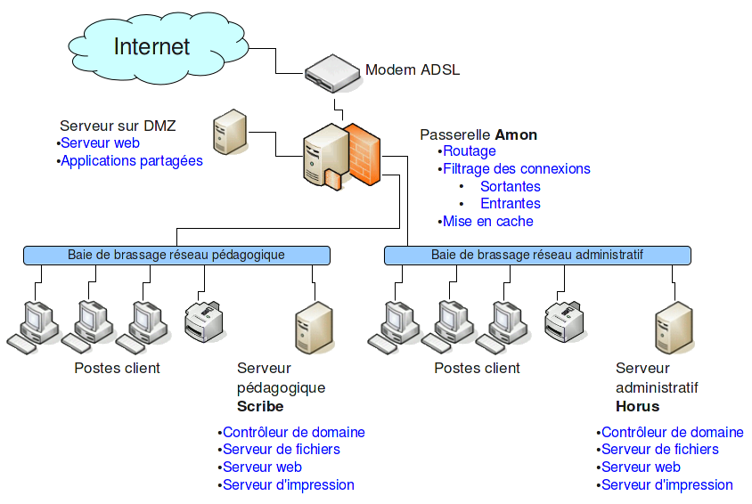Déroulement de la formation

Durant cette formation, nous allons simuler un réseau d'établissement
grâce à des machines virtuelles. Cela nous permettra de contrôle
complètement tous les éléments, d'effectuer tous les tests sans risque
pour les machines réelles et le réseau qui nous entourent.

Sur la figure suivante, on simule plusieurs machines sur une seule
appelée machine hôte. Un poste windows virtuel est un ordinateur
virtuel sur leque a été installé un système d'exploitation comme on le
fait sur une machine réelle.

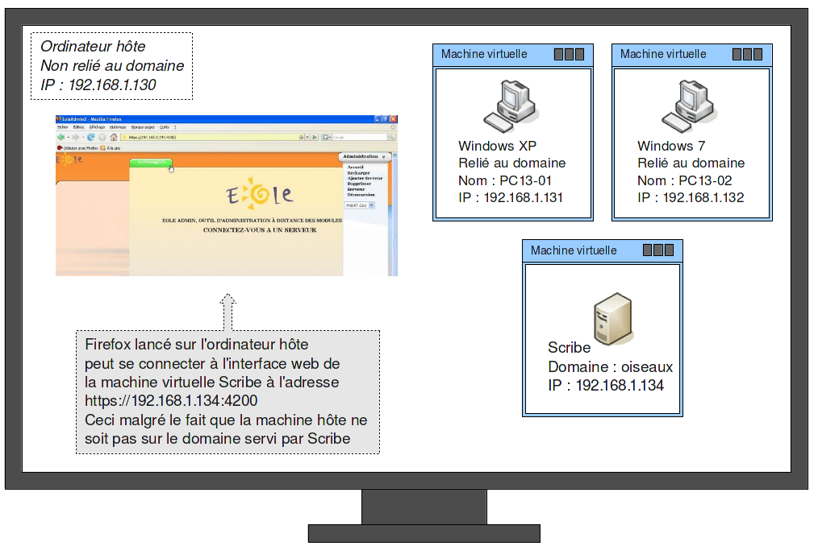La situation décrite ci-dessus est
équivalente à la suivante :

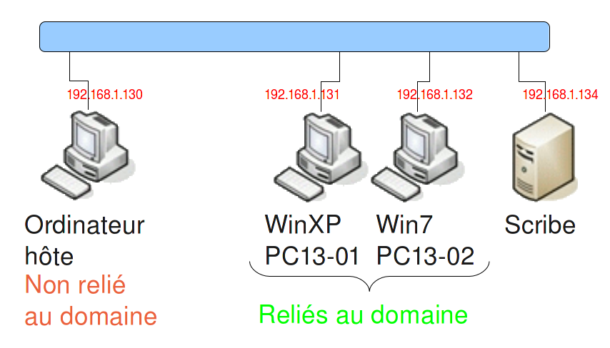\

\

\

\

\

\

\

\

\

\

\

\

\

\

Notre travail maintenant est de créer la machine virtuelle qui va
accueillir le sytème d'exploitation Linux sur lequel fonctionne.

Après avoir demandé la création d'une nouvelle machine dans VirtualBox,
puis donné un nom (disons scribe) et choisi le type de système
d'exploitaion (ici Linux-Ubuntu), passez toutes les étapes en acceptant
les choix par défaut (sauf pour la mémoire vive que nous passerons de
512Mo à 256Mo).

Une fois ces opérations terminées,

-   cocher la case «Activer PAE/NX» dans l’onglet «Processeur» de la
    section «Système» de votre machine virtuelle.

-   choisir le mode d’accès par pont pour la carte réseau 1. Elle
    prendra ainsi une adresse sur le réseau sur lequel se trouve la
    machine hôte.

-   L'image iso du dvd eole, téléchargée sur le site Eole
    //eoleng.ac-dijon.fr/pub/iso/ doit être monté comme un cd(ou dvd)
    virtuel, pour cela cliquez sur l'icône cd-rom dans l'onglet
    «Stockage», comme sur l'image ci-dessous puis naviguez dans
    l'arborescence pour indiquer le fichier .iso.

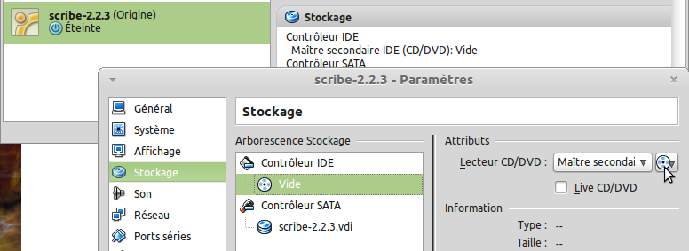\

On peut alors mettre en marche la machine virtuelle.

# 2. Mise en place du serveur

## Installation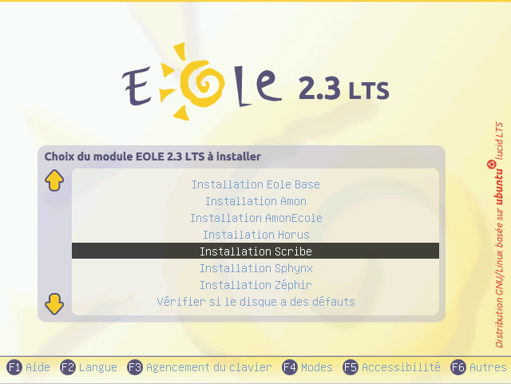

Après avoir vérifié au niveau du BIOS

que la machine démarre prioritairement

sur le CD, le menu ci-contre apparaît.

\

Une bonne idée consiste à vérifier si le disque (le CD) a des défauts
afin d’éviter de perdre du temps avec une installation qui échouerait
sans doute.

Une fois ceci fait, lançons l’installation de Scribe.

La procédure est automatique et vous n’avez qu’à observer les étapes

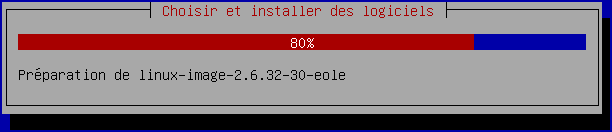

Après redémarrage, le gestionnaire de démarrage GRUB vous propose
plusiers entrées. Nous choisissons celle par défaut

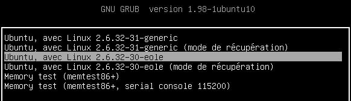

Vous pouvez maintenant vous identifier avec le login «root».

-   Pour scribe 2.2, le mot de passe est «eole»,

-   Pour scribe 2.3, le mot de passe est «$eole&123456$».

Avant de nous lancer dans la configuration de notre contôleur de domaine
scribe, notons ici quelques informations réseau dont nous aurons besoin
pour configurer notre serveur :

\

L'adresse IP fixe que nous allons lui attribuer : \_ \_ \_ . \_ \_ \_ .
\_ \_ \_ . \_ \_ \_

Le masque de sous-réseau : \_ \_ \_ . \_ \_ \_ . \_ \_ \_ . \_ \_ \_

L'adresse de broadcast : \_ \_ \_ . \_ \_ \_ . \_ \_ \_ . \_ \_ \_

L'adresse IP du ou des serveur(s) DNS : \_ \_ \_ . \_ \_ \_ . \_ \_ \_ .
\_ \_ \_

\_ \_ \_ . \_ \_ \_ . \_ \_ \_ . \_ \_ \_

Le nom que nous donnerons à la machine :

Le nom du domaine auquel les clients vont s'authentifier :

Le mot de passe root : dog!cat$mouse

Le mot de passe eole ou scribe : fox!bird$fly

Le mot de passe admin : plop

root : utiisateur linux ; a tous les droits sur le serveur

scribe : utilisateur linux ; peut faire certains tests via une interface
graphique

admin : utilisateur samba ; gestionnaire des machines une fois celles-ci
connectées au domaine , c'est l'administrateur réseau).

\

Mise à jour :

Maj-Auto -i

\

Saisissez la commande gen\_config qui va lancer le générateur de
configuration

root@scribeng:\~\# gen\_config

La série d’écrans est à renseigner en étant très attentif.

### Configuration scribe 2.2

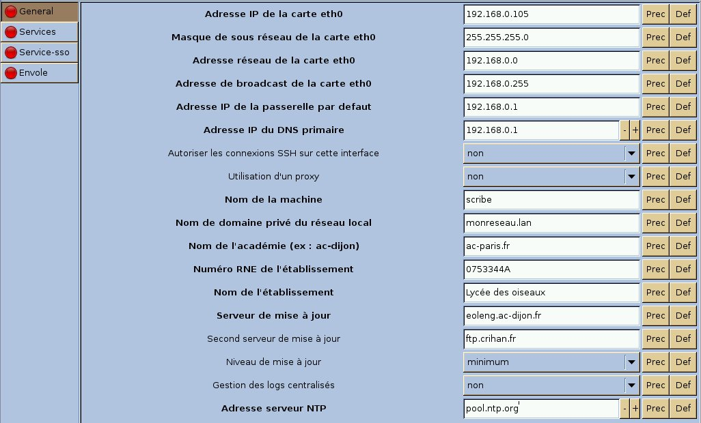

\

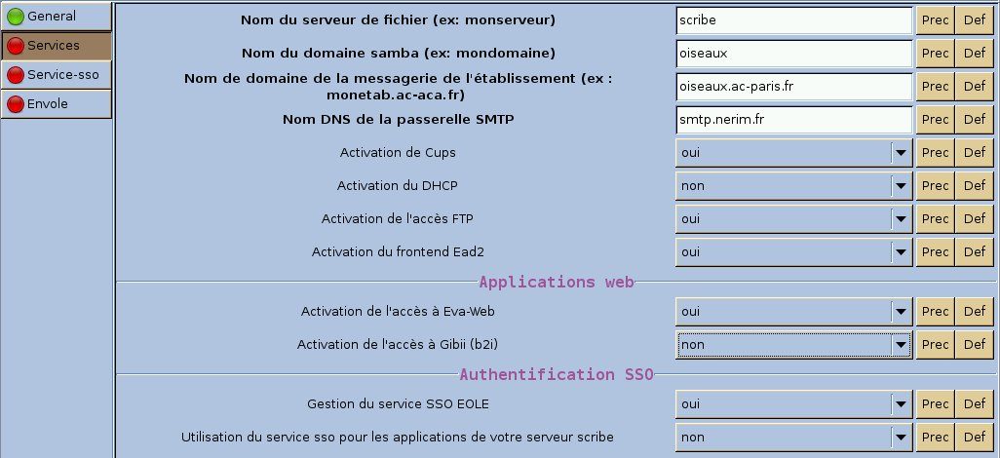

\

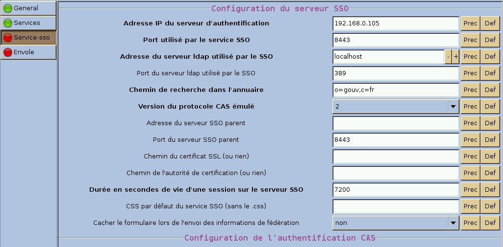

\

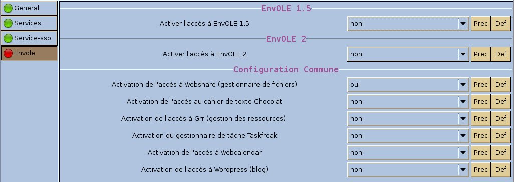

\

\

\

\

### Configuration scribe 2.3

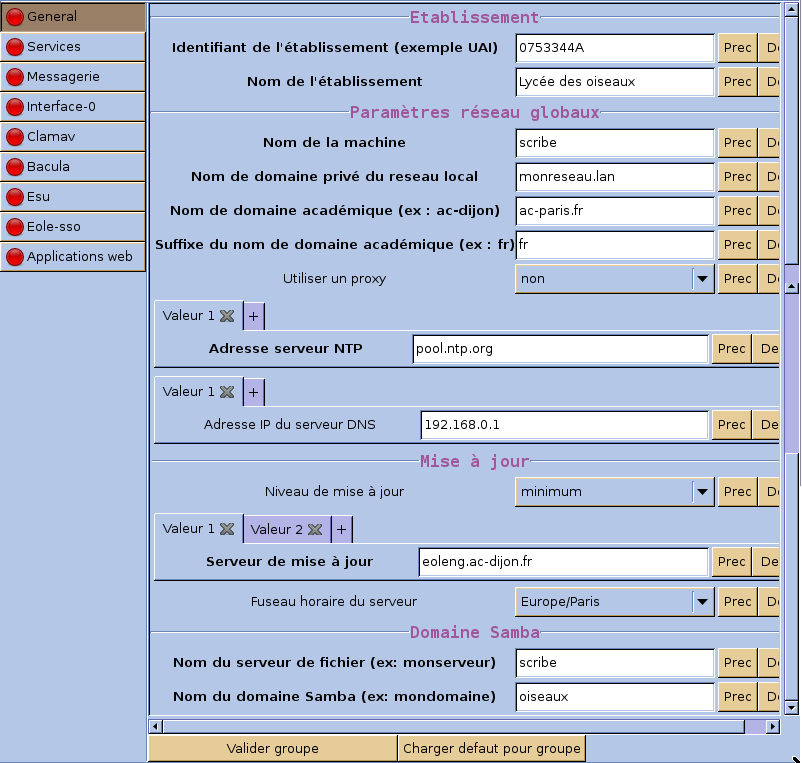

\

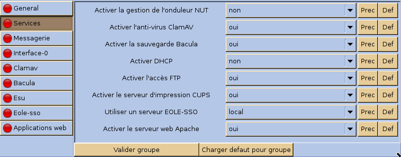

\

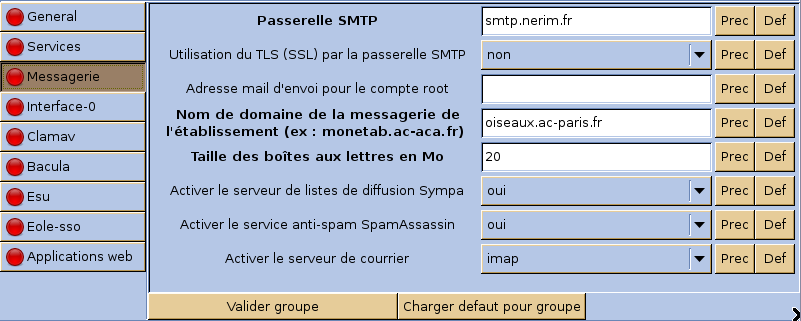

\

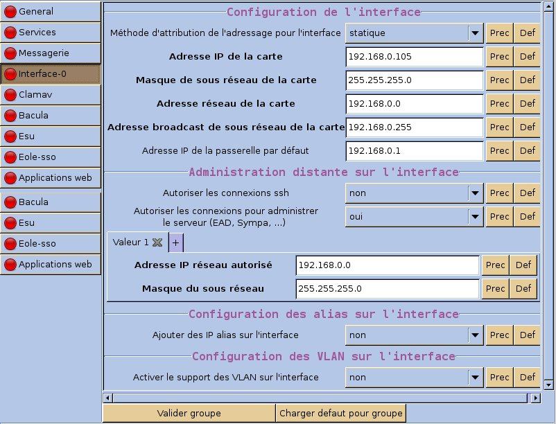

\

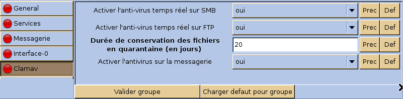

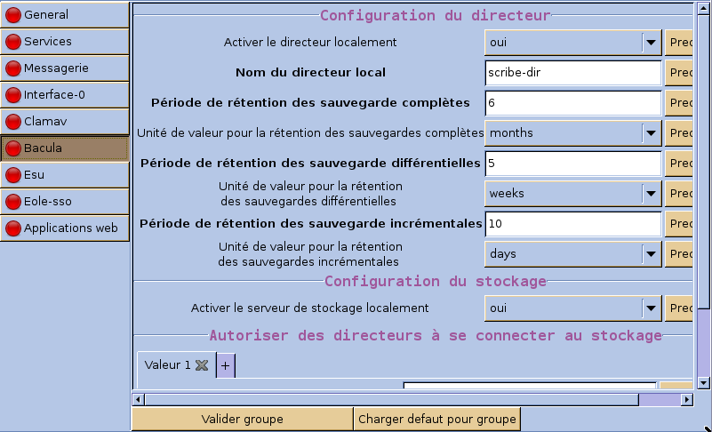

\

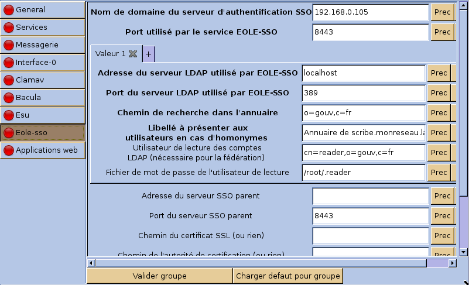

\

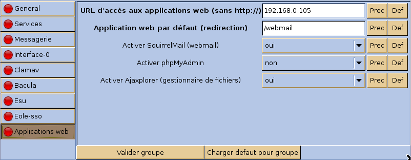

### Instanciation

Après avoir rempli les champs, on peut enregistrer ces paramètres qui
vont constituer un fichier nommé «zephir.eol» dont le rôle est de donner
les instructions au programme d’instanciation instance.

root@scribeng:\~\# instance
zephir.eol

\

Au cours de l’exécution du programme, il vous sera demandé de changer
les mots de passe

-   du super administrateur Linux nommé «root»;

-   de l’administrateur scribe restreint nommé «eole» ou «scribe»

-   de l’admistrateur du domaine nommé «admin».

Lors de l’installation, le programme vous proposera sans doute des
télécharger des mises à jour il est essentiel d’accepter car elles
corrigent des problèmes de sécurité comme elles apportent des
améliorations des programmes de la distribution Ubuntu mais aussi de la
suite Scribe développée par l’académie de Dijon.

À la fin du processus, après construction des bases de données et
exécution de tous les scripts de pré/postinstance, la machine doit
redémarrer.

### Pourquoi n'utiliser instance qu'une seule fois ?

Un fois les modifications apportées au fichier config.eol, on se gardera
bien de relancer le programme d’instanciation instance. En effet il
poserait des questions inutiles, pourrait effacer des comptes, perturber
gravement les connexions au domaine des machines déjà intégrées.

En cas de changement sur le réseau ou d’erreur lors de la configuration,
il est possible de relancer la commande gen\_config afin de modifier
le fichier /etc/eole/config.eol. Pour ensuite lancer une reconfiguration
avec le programme reconfigure.

\

\1. Modifier la configuration

root@scribeng:\~\# gen\_config
/etc/eole/config.eole

\

\2. Reconfigurer

root@scribeng:\~\# reconfigure

dont la fonction est de lire le fichier /etc/eole/config.eol pour en
appliquer les paramètres aux différents services en fonctionnement.

## Intégration des clients au domaine

-   Première étape : faire entrer les machines windows dans le domaine.

La copie d’écran suivante montre l’utilisateur admin faisant entrer
dans le domaine une machine sous WindowsXP

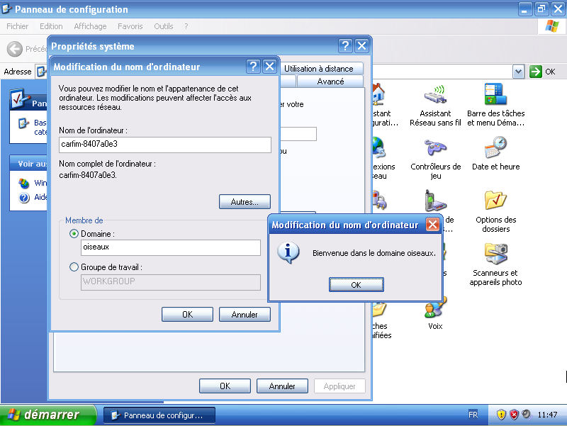

-   Deuxième étape : installer le client scribe.

Après redémarrage et connexion en tant qu’admin sur le domaine,
rendons-nous dans le poste de travail puis dans le répertoire personnel
nommé U: Nous allons exécuter le programme
Install\_Client\_Scribe.

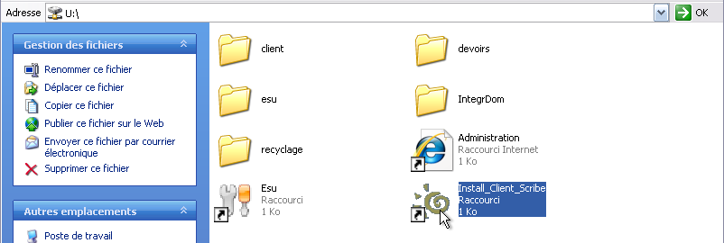

# 3. L’E.A.D. (Eole ADmininistration)

## Présentation

L’EAD est une interface WEB qui permet de faire l'administration de
premier niveau de toutes les composantes du serveur Scribe : système,
messagerie, utilisateurs, groupes,… Il offre également aux professeurs
la possibilité de modifier leurs préférences, gérer les élèves, les
groupes dont ils sont responsables…

L'accès à l’EAD se fait depuis le navigateur web FIREFOX ou CHROME
(mais PAS Internet Explorer) avec l'URL suivante :
[https://nom-du](https://nom-de/)-serveur[-](https://srv-scribe:4200/)[scribe](https://srv-scribe:4200/)[:4200](https://srv-scribe:4200/)
(ou
[https](https://xxx.xxx.xxx.xxx:4200/)[://](https://xxx.xxx.xxx.xxx:4200/)[xxx](https://xxx.xxx.xxx.xxx:4200/)[.](https://xxx.xxx.xxx.xxx:4200/)[xxx](https://xxx.xxx.xxx.xxx:4200/)[.](https://xxx.xxx.xxx.xxx:4200/)[xxx](https://xxx.xxx.xxx.xxx:4200/)[.](https://xxx.xxx.xxx.xxx:4200/)[xxx](https://xxx.xxx.xxx.xxx:4200/)[:4200](https://xxx.xxx.xxx.xxx:4200/)
avec l’adresse IP du serveur Scribe).

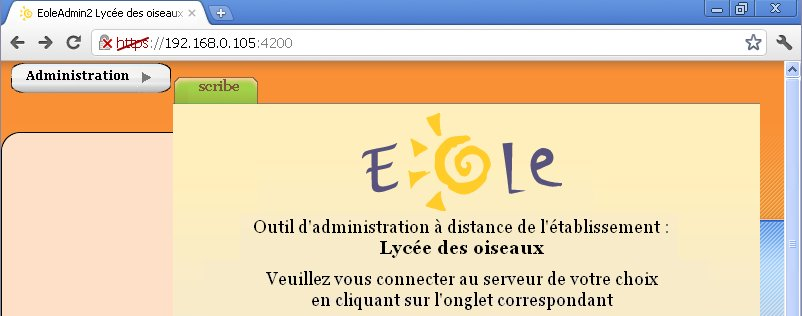

Cliquez sur scribe puis à la connexion entrez le nom d’utilisateur et le
mot de passe associé.

En tant qu’administrateur, vous allons créer la base des élèves de
l’établissement à partir des fichiers zip ou xml récupérés depuis sconet
(fichiers exemple sur
[http](http://cjoint.com/?0AiqKCRRtW3)[://](http://cjoint.com/?0AiqKCRRtW3)[cjoint](http://cjoint.com/?0AiqKCRRtW3)[.](http://cjoint.com/?0AiqKCRRtW3)[com](http://cjoint.com/?0AiqKCRRtW3)[/?0](http://cjoint.com/?0AiqKCRRtW3)[AiqKCRRtW](http://cjoint.com/?0AiqKCRRtW3)[3](http://cjoint.com/?0AiqKCRRtW3))
:

-   ExportXML\_ElevesSansAdresses.zip ou ElevesSansAdresses.xml

-   ExportXML\_Nomenclature.zip ou Nomenclature.xml

-   ExportXML\_Structures.zip ou Structures.xml

Dans l’EAD, cliquez Outils puis successivement sur Importation -\>
Importation annuelle des bases. Choisissez ensuite «Sconet» puis «Élèves
seulement». Les trois fichiers seront traités pour intégrer les élèves
au système en créant leurs identifiants et mots de passe selon vos
préférences.

\

Les profils utilisateurs représentent l'environnement par défaut des
utilisateurs. Il existe trois types de profils :

-   le profil local : il est stocké sur la station Windows,
    l'environnement est donc modifié lorsque l'utilisateur change de
    poste

-   le profil itinérant : il est stocké dans le répertoire personnel de
    l'utilisateur, l'environnement suit l'utilisateur

-   les profils obligatoires : ils sont stockés dans un répertoire
    commun, l'environnement est le même pour tous mais il faut
    générer les profils avant de pouvoir les utiliser

EOLE gère ces trois types. Il n'y a rien de particulier à faire pour les
profils locaux ou itinérants. Par contre, il faut créer les profils
obligatoires.

\

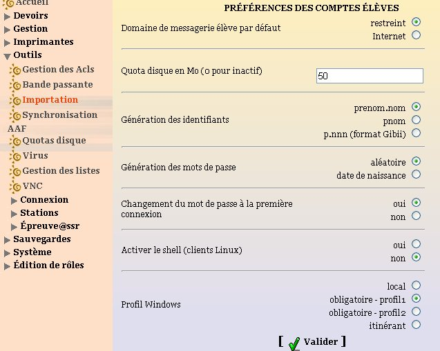

il est aussi possible de passer par l’import d’un fichier plus
rudimentaire au format texte .csv dont voici une strucure type :

"numero";"nom";"prenom";"sexe";"date";"classe";"niveau"

"0224ISWV7201";"DUPOND";"Norbert";"M";"07/12/1997";"3e1";"3"

"0544ETME3593";"MARTIN";"Maxence";"F";"04/09/1999";"4e1";"4"

"3887ELDEX3983";"DURAND";"Raoul";"M";"03/02/1999";"4e1";"4"

## Exercices sur la gestion des utilisateurs

Exercice 1 : Créer les comptes à partir des fichiers sconet.

-   Tester un ou deux des comptes créés.

-   Dans l’EAD, accéder au compte d’un élève, lire les informations
    disponibles (en particulier le quota disque) et réinitialiser son
    mot de passe (en forçant sa modification à la 1ère connexion)

-   Tester l’édition groupée pour réinitialisation tous les mots de
    passe des élèves.

Exercice 2 : Créez un nouvel élève, ayant les propriétés suivantes
:

-   Login : votreprenom.eleve (N ⇒ numéro donné par le formateur)

-   prénom : le votre , nom = eleve , mot de passe = 1234

-   Numéro interne de l'élève : 400N

-   Quota disque = 50 Mo

-   Date de naissance = date du jour

-   Profil utilisateur = Obligatoire

-   Classe : stage\_formation3

-   Vérifier sa connexion et l'accès à ses partages dans le poste de
    travail

-   Listez tous les élèves dont le login commence par un T

-   Editez les propriétés d'un élève

-   Editez les propriétés d'un professeur

Exercice 4 : Créez un nouveau professeur, ayant les propriétés
suivantes :

Attention les caractères spécifiques tels que les accents sont interdits
dans le nom de login

-   Login : votreprenom.prof

-   prénom : le votre , nom = prof, mot de passe = 1234

-   Quota disque = 100 Mo

-   Profil utilisateur = Obligatoire

-   Il n'est pas professeur principal, ni membre du groupe DomainAdmins

-   Pas d'activation du Shell

Exercice 5 : L'utilisateur crée dans l'exercice précédent est
professeur de mathématiques dans les classes 4e1 et 4e2

-   Créez la matière Mathématiques

-   Inscrivez-le dans sa matière, ses équipes pédagogiques et
    permettez-lui d'administrer la classe de 4e1

-   Vérifier sa connexion et l'accès à ses partages dans le poste de
    travail.

-   Se connecter à l'EAD en tant que professeur et vérifier son statut
    de professeur administrateur de la classe 4e1.

## Exercices sur la gestion des groupes

Exercice 1 : Vérifier si le groupe “Documentation” existe. Dans la
négative :

-   créer un groupe de type Matières dont l'intitulé est
    “Documentation”.

-   Avec Partage et Modèle Données/Travail

-   Pas de liste de diffusion

-   Inclure les documentalistes dans le groupe “Documentation” (les
    créer si nécessaire et les associer à toutes les classes)

Exercice 2 : Créer un groupe “stage” ayant les propriétés
suivantes :

-   Type “groupe”

-   Avec partage : Modèle Données/Travail

-   Pas de liste de diffusion

-   Membres : 3 élèves (penser à leur appartenance à une classe pour les
    affecter tous en une seule manipulation) et le professeur
    “votreprenom.prof”.

-   Lister les membres du groupe stage via l'EAD

-   Vérifier la création du partage et les droits effectifs des
    utilisateurs

# 4. ESU (Environnements Sécurisés des Utilisateurs)

## Présentation

ESU permet de gérer de façon la configuration de l'environnement de
l'utilisateur sur les stations Windows.Cette configuration est établie à
l'ouverture de la session, en fonction du nom de la machine et du groupe
d'utilisateurs auquel appartient l'utilisateur.

\

-   ESU configure les environnements à partir de règles (des clés de la
    base de registre Windows) qui sont stockées dans le fichier XML
    \\\\<adresse\_serveur\>\\esu\\Console\\ListeRegles.xml.

-   ESU permet de gérer le cragement des icônes du bureau et du menu
    démarrer. Ces icônes sont stockées dans le lecteur R: (icones$).
    On trouve ici les dossiers correspondant aux groupes de machines
    définis dans ESU.

    Par exemple pour le groupe grp\_eole créé par défaut à
    l’installation de scribe,

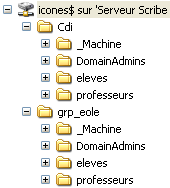\

-   les icônes placées dans R:\\grp\_eole\\\_Machine\\Bureau seront
    visibles par tous les utilisateurs du groupe grp\_eole;

-   les icônes placées dans R:\\grp\_eole\\professeurs\\Bureau ne
    seront visibles que par les professeurs du groupe grp\_eole;

-   les éléments placés dans R:\\grp\_eole\\professeurs\\Menu
    Démarrer s’afficheront dans le menu Démarrer des utilisateurs du
    groupe grp\_eole;

\

\

\

Profils utilisateurs et ESU

Il est important de distinguer les profils utilisateurs (notion interne
à Windows) et ESU. Les profils utilisateurs sont appliqués en premier et
définissent un environnement de départ. La configuration ESU est
appliquée ensuite et modifie, ajoute ou supprime des paramètres de cet
environnement.

Par exemple, le menu démarrer est contenu dans le profil de
l'utilisateur mais si un chemin alternatif est défini dans ESU (Console
ESU : `Windows => Dossiers`) alors, le menu démarrer utilisé sera
celui défini dans ESU, et non celui du profil.

Pour lancer la console, cliquez sur le raccourci présent dans le
répertoire personnel d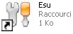e l’utilisateur
admin. Par défaut, seul l'utilisateur admin a accès à la console.

\

La console ESU sert à paramétrer les règles qui seront appliquées sur
les machines clientes lors de l'ouverture de session. Elles sont
réparties en deux groupes :

-   les règles "machines" définissant le comportement global des
    machines, elles sont appliquées quelque soit l'utilisateur qui se
    connecte ;

-   les règles "utilisateurs" définissant l'environnement de
    l'utilisateur comme les restrictions, le paramétrage de
    l'explorateur et du fond d'écran, etc.

-   Chaque coche peut prendre 3 états :

cochée : Règle activée

décochée : Règle désactivée

grisée : Règle non prise en compte

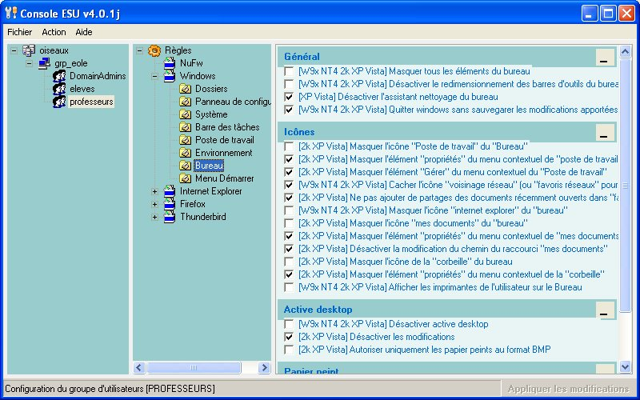

## Règles de priorité dans l'application des règles ESU

Lors de l'ouverture de session, ESU va chercher à quel groupe de
machines appartient la machine sur laquelle l'utilisateur se connecte.
Si un groupe de machine est trouvé, ESU va chercher s'il contient
l'utilisateur ou un des groupes auxquels l'utilisateur appartient.

La liste des groupes de machines et des utilisateurs est parcourue du
haut vers le bas. Si une machine appartient à plusieurs groupes, le
premier sera utilisé, les autres ignorés. Il en va de même pour les
utilisateurs/groupes d'utilisateurs.

La même politique s’applique aux utilisateurs s’ils appartiennent à
plusieurs groupes. Ainsi l'utilisateur admin fait partie du groupe
professeurs mais, il est également membre du groupe DomainAdmins. Au vu
des priorités, c'est le dossier défini d'icônes du groupe DomainAdmins
(R:\\grp\_eole\\professeurs\\Bureau) qui lui sera proposé.

Lire :
[http](http://eoleng.ac-dijon.fr/documentations/ClientScribe/co/01-Esu-console_6.html)[://](http://eoleng.ac-dijon.fr/documentations/ClientScribe/co/01-Esu-console_6.html)[eoleng](http://eoleng.ac-dijon.fr/documentations/ClientScribe/co/01-Esu-console_6.html)[.](http://eoleng.ac-dijon.fr/documentations/ClientScribe/co/01-Esu-console_6.html)[ac](http://eoleng.ac-dijon.fr/documentations/ClientScribe/co/01-Esu-console_6.html)[-](http://eoleng.ac-dijon.fr/documentations/ClientScribe/co/01-Esu-console_6.html)[dijon](http://eoleng.ac-dijon.fr/documentations/ClientScribe/co/01-Esu-console_6.html)[.](http://eoleng.ac-dijon.fr/documentations/ClientScribe/co/01-Esu-console_6.html)[fr](http://eoleng.ac-dijon.fr/documentations/ClientScribe/co/01-Esu-console_6.html)[/](http://eoleng.ac-dijon.fr/documentations/ClientScribe/co/01-Esu-console_6.html)[documentations](http://eoleng.ac-dijon.fr/documentations/ClientScribe/co/01-Esu-console_6.html)[/](http://eoleng.ac-dijon.fr/documentations/ClientScribe/co/01-Esu-console_6.html)[ClientScribe](http://eoleng.ac-dijon.fr/documentations/ClientScribe/co/01-Esu-console_6.html)[/](http://eoleng.ac-dijon.fr/documentations/ClientScribe/co/01-Esu-console_6.html)[co](http://eoleng.ac-dijon.fr/documentations/ClientScribe/co/01-Esu-console_6.html)[/01-](http://eoleng.ac-dijon.fr/documentations/ClientScribe/co/01-Esu-console_6.html)[Esu](http://eoleng.ac-dijon.fr/documentations/ClientScribe/co/01-Esu-console_6.html)[-](http://eoleng.ac-dijon.fr/documentations/ClientScribe/co/01-Esu-console_6.html)[console](http://eoleng.ac-dijon.fr/documentations/ClientScribe/co/01-Esu-console_6.html)[\_6.](http://eoleng.ac-dijon.fr/documentations/ClientScribe/co/01-Esu-console_6.html)[html](http://eoleng.ac-dijon.fr/documentations/ClientScribe/co/01-Esu-console_6.html)

## Exercices sur ESU

ASTUCE : Pensez à appliquer vos modifications :
 en bas à droite.

ASTUCE : Lors de la mise en place de la configuration d'ESU, il est
souvent nécessaire de ré-ouvrir une session pour tester les nouveaux
paramétrages. La ré-application des règles sans avoir à ré-ouvrir une
session peut se faire avec :

Démarrer =\> Exécuter =\> "%WINDIR%\\Eole\\cliscribe\\logon.exe"

Exercice 1 : Création d'un groupe de machines géré par ESU

-   créer un groupe de machines “Cdi” et le monter au dessus du
    groupe de machines grp\_eole.

-   ajouter l'ordinateur windows sur lequel vous travaillez au groupe de
    machines.

-   Ajoutez une icône de raccourci vers Internet Explorer sur le bureau
    de tous (dossier \_Machine de Cdi du répertoire R:) puis
    une icône de raccourci vers wordpad dans le menu démarrer et sur
    le bureau des professeurs.

-   Se connecter en tant qu'élève pour voir les modifications puis en
    tant que professeur.

Exercice 2 : Modifier les règles suivantes dans le groupe Cdi
:

-   Pour le rôle “eleves”

-   Windows - Bureau - Icônes : Masquer l'icône de la corbeille.

-   Windows - Bureau - Papier peint : Imposer un papier peint (format
    bmp obligatoire pour permettre l'inclusion du texte en
    surimpression)

-   Autoriser le clic-droit contextuel.

-   Pavé numérique activé.

-   Pour le rôle “professeurs”

-   Firefox : Modifier la page de démarrage

-   Windows - Menu Démarrer - Général - Masquer le Menu Rechercher du
    Menu Démarrer

-   Activer le menu Démarrer classique

-   Se connecter en tant qu'élève pour voir les modifications puis en
    tant que professeur.

Exercice 3 :

-   Copier l'ensemble du menu démarrer du réperoire All Users de
    Document and Settings de votre poste dans le groupe machines
    correspondant à Cdi et faites faites-y un peu de ménage.

-   Mettre à disposition un raccourci vers le webmail académique
    ([https](https://webmail.ac-lyon.fr/)[://](https://webmail.ac-lyon.fr/)[webmail](https://webmail.ac-lyon.fr/)[.](https://webmail.ac-lyon.fr/)[ac](https://webmail.ac-lyon.fr/)[-](https://webmail.ac-lyon.fr/)[paris](https://webmail.ac-lyon.fr/)[.](https://webmail.ac-lyon.fr/)[fr](https://webmail.ac-lyon.fr/)[/](https://webmail.ac-lyon.fr/))
    dans le Menu Démarrer (dossier Internet) et sur le bureau des
    professeurs du Cdi.

## Modification du texte du papier-peint

Il est possible de modifier le contenu du texte qui s’affiche sur le
fond d'écran. Pour cela, créer un fichier
U:\\esu\\Base\\<groupe\_de\_machine\>\\<utilisateur\_ou\_groupe\>.bgd.

Ainsi, pour modifier le texte du fond d'écran pour les membres du groupe
DomainAdmins dans le groupe de machine grp\_eole, créez
le fichier
U:\\esu\\Base\\grp\_eole\\DomainAdmins.bgd.

Ce fichier peut contenir des variables suivantes :

-   %ESU\_GU% : Nom du groupe d'utilisateur ESU de l'utilisateur

-   %ESU\_GM% : Nom du groupe de machine ESU

-   %USERNAME% : Login de l'utilisateur

-   %USERLNAME% : Nom et prénom de l'utilisateur

-   %ESU\_PROXY\_HOST%, %ESU\_PROXY\_PORT%, %ESU\_PROXY\_BYPASS%

-   %ESU\_PDC%, %ESU\_DOMAINE%, %GROUPES%

-   %COMPUTERNAME%, %ESU\_OS%, %SID%, %IP%

-   %ESU\_PARTAGE\_ICONES%, %ESU\_LECTEUR\_ICONES%

-   Ainsi que toutes les variables d'environnement Windows (%WINDIR%,
    %PATH%, ...)

Voici un exemple d’application :

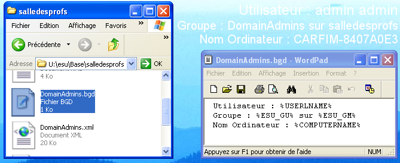

# 5. L’arborescence du réseau Scribe

## Les lecteurs réseau par défaut

Voici une arborescence complète d'un poste client sur un domaine scribe

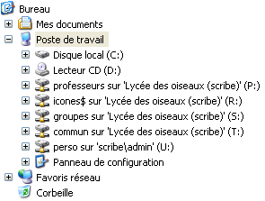

professeurs (P:). Le professeur trouve ici deux icônes :

-   Administration donne accès à l’EAD. Il permet de changer un
    certain nombre de ses propres paramètres, ainsi que ceux des
    élèves dont il est le professeur principal.

-   Gestion-postes permet au professeur, depuis la station où il se
    trouve, de :

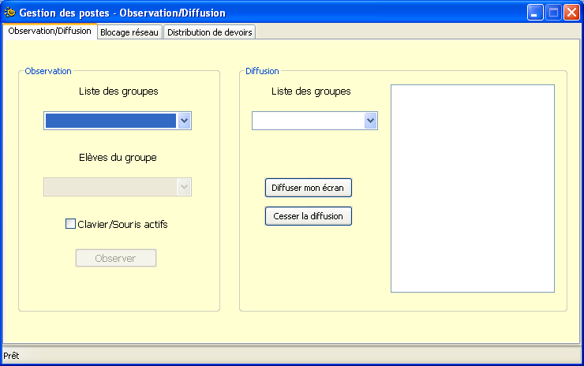\

\

\

\

\

\

\

\

\

-   Surveiller ce que font les élèves d’une classe, sur les stations
    où ils sont connectés.

-   Diffuser son écran aux élèves de sa classe.

-   Définir les blocages réseau des élèves .

-   Distribuer/Ramasser les devoirs.

icones$ (R:). Étudié plus haut dans le paragraphe sur ESU.

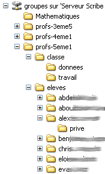groupes (S:). Le professeur trouve
ici un dossier pour chacune de ses classes ou groupes.

Chaque dossier contient lui-même deux sous-dossiers :

-   classe qui contient

-   le sous-dossier "données" pour les documents mis à la
    disposition des élèves par les professeurs. Les élèves peuvent
    lire ces documents, mais ne peuvent y écrire.

-   le sous-dossier "travail" contenant éventuellement un dossier
    au nom de chaque discipline enseignée : Maths, Français, ... Les
    élèves puissent y déposer leurs travaux.

-   eleves qui contient lui-même des sous-dossiers au nom de chacun
    des élèves de la classe concernée. Ces dossier au nom des
    élèves sont les dossiers "perso" de chacun de vos élèves. Vous
    avez le droit d’y lire les documents, mais vous ne pouvez y
    enregistrer des fichiers sauf par l'intermédiaire de l'outil
    gestion-postes qui permet de distribuer un "devoir" à tous les
    élèves d’une de vos classes. C’est dans leur dossier "perso (U:)"
    que ce devoir va arriver.

Le sous-dossier "prive" de l’élève ne vous est pas accessible.

commun (T:). Le professeur trouve ici deux dossiers, visibles par
tous les utilisateurs du réseau :

-   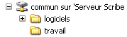logiciels contient des
    logiciels en réseau, ou bien données en lecture seule

    -   travail contient les documents déposés par les professeurs.
        Les élèves n’y ont accès qu’en lecture.

Rappel : ne pas confondre le dossier «Travail » du lecteur S : et celui
du lecteur T : , les stagiaires n’ont pas le droit d’écriture sur ce
dernier.

perso (U:) chacun trouve ici son espace de travail personnel. Il
peut y créer ses sous-dossiers à sa convenance. C’est là que vont se
stocker les fichiers quand l’utilisateur enregistre dans "Mes
Documents". Cet espace personnel peut être limité en taille avec le
système des quotas.

### Résumé sous forme d’un tableau

Lecteurs réseaux

Contenu

Professeurs (P:)

-   Gestion des postes (observation, diffusion, blocage Internet…) des
    postes stagiaires.

-   Administration des comptes : création des groupes, des comptes,
    mofications des mots de passe…

Icones$ (R:)

Icones des bureaux des ordinateurs par salle : pour information, seul
l’administrateur de groupe de salle peut les modifier.

Groupes (S:)

Regroupe des espaces d’échange

Commun (T:)

-   Logiciels : espace logiciels ou données (accessible à tous les
    utilisateurs pour l’exécution ou la lecture mais à l’administrateur
    seulement pour l'écriture)

-   Travail : espace accessible à tous : professeurs (lecture+écriture)
    et élèves (lecture seule)

Perso (U:)

Espace personnel de l'utilisateur

### Résumé sous forme d’une image

\

## 

## Exercices sur le partage réseau

Exercice 1 : Connecté sur 2 postes (un élève et un professeur)
tester les fonctionnalités de l'outil Gestion-postes

-   Observation / diffusion

-   Blocage du poste élève (Internet/lecteurs)

-   Distribution d’un travail et ramassage.

Exercice 2 : Sur le lecteur S: (Groupes)

-   Vérifier les accès et « les droits : lecture/écriture/exécution»
    pour le professeur et les élèves

-   En tant que professeur, mettre un document test01.txt à
    disposition des élèves d'une classe (sans possibilité de
    modification)

-   En tant qu'élève de cette classe, ouvrir ce document, le modifier et
    l’enregistrer sous le nom test02.txt dans «Travail » et sous le
    nom test03.txt dans le répertoire pesonnel (mais non privé) de
    l'élève.

-   En tant que professeur, vérifier l'accès et les droits sur les
    fichiers test02.txt et test03.txt.

Exercice 3 :

-   En tant qu'administrateur, télécharger l'application « [freemind
    portable](http://framakey.org/Portables/PortableFreemind) » et
    l’installer sur le bon espace.

-   Mettre un raccourci sur le bureau d'un groupe de salles ESU que vous
    avez configuré.

-   En tant qu'élève, tester l’accès à l’application installée.

Exercice 4 : Pour chaque cas ci-dessous, indiquer quel répertoire
il faut utiliser.

Fichier partagé : Tous les droits (Lire,
Ecrire, Copier, Modifier, Supprimer)

Fichier accessible : Lire, Copier

Un professeur souhaite mettre
des fichiers à disposition

1 - Fichier partagé avec tous les professeurs et accessible à tous les
élèves

Ex : Banque d'images ou de sons libres de droits

=\>\_\_\_\_\_\_\_\_\_\_\_\_\_\_\_\_\_\_\_\_\_\_\_\_\_\_\_\_\_\_\_\_\_\_\_\_\_\_\_\_\_\_\_\_\_\_\_\_\_\_\_\_\_\_\_\_\_\_\_\_\_\_\_\_\_\_\_\_\_\_\_\_\_\_\_\_\_\_\_\_

2 - Fichier partagé avec tous les professeurs de sa matière (équipe
disciplinaire)

Ex : Devoir commun de Français

=\>\_\_\_\_\_\_\_\_\_\_\_\_\_\_\_\_\_\_\_\_\_\_\_\_\_\_\_\_\_\_\_\_\_\_\_\_\_\_\_\_\_\_\_\_\_\_\_\_\_\_\_\_\_\_\_\_\_\_\_\_\_\_\_\_\_\_\_\_\_\_\_\_\_\_\_\_\_\_\_\_

3 - Fichier partagé avec tous les professeurs d'une classe (équipe
pédagogique)

Ex : Synthèse du conseil de classe de mi-trimestre pour la 4B

=\>\_\_\_\_\_\_\_\_\_\_\_\_\_\_\_\_\_\_\_\_\_\_\_\_\_\_\_\_\_\_\_\_\_\_\_\_\_\_\_\_\_\_\_\_\_\_\_\_\_\_\_\_\_\_\_\_\_\_\_\_\_\_\_\_\_\_\_\_\_\_\_\_\_\_\_\_\_\_\_\_

4 - Dans une classe donnée : fichier partagé avec tous les professeurs
et accessible à

tous les élèves Ex : Calendrier d'un voyage pour la classe de 3A

=\>\_\_\_\_\_\_\_\_\_\_\_\_\_\_\_\_\_\_\_\_\_\_\_\_\_\_\_\_\_\_\_\_\_\_\_\_\_\_\_\_\_\_\_\_\_\_\_\_\_\_\_\_\_\_\_\_\_\_\_\_\_\_\_\_\_\_\_\_\_\_\_\_\_\_\_\_\_\_\_\_

5 - Distribuer un fichier à chacun des élèves d'une classe

Ex : Un énoncé de devoir, un fond de carte, une image couleur à chaque
élève de la classe de 4C

=\>\_\_\_\_\_\_\_\_\_\_\_\_\_\_\_\_\_\_\_\_\_\_\_\_\_\_\_\_\_\_\_\_\_\_\_\_\_\_\_\_\_\_\_\_\_\_\_\_\_\_\_\_\_\_\_\_\_\_\_\_\_\_\_\_\_\_\_\_\_\_\_\_\_\_\_\_\_\_\_\_

6 - Donner un devoir à un élève précis

Ex : Distribuer un devoir de rattrapage à l'élève Guy Dondecourse de la
classe de 3E

=\>\_\_\_\_\_\_\_\_\_\_\_\_\_\_\_\_\_\_\_\_\_\_\_\_\_\_\_\_\_\_\_\_\_\_\_\_\_\_\_\_\_\_\_\_\_\_\_\_\_\_\_\_\_\_\_\_\_\_\_\_\_\_\_\_\_\_\_\_\_\_\_\_\_\_\_\_\_\_\_\_

Un élève souhaite mettre des
fichiers à disposition

7 - Dans une classe donnée : fichier partagé avec tous les professeurs
et les élèves

Ex : L'élève Emmy Sphère de 5A propose un article pour le journal de sa
classe

=\>\_\_\_\_\_\_\_\_\_\_\_\_\_\_\_\_\_\_\_\_\_\_\_\_\_\_\_\_\_\_\_\_\_\_\_\_\_\_\_\_\_\_\_\_\_\_\_\_\_\_\_\_\_\_\_\_\_\_\_\_\_\_\_\_\_\_\_\_\_\_\_\_\_\_\_\_\_\_\_\_

# 6. Scripts de Netlogon

Lorsqu'un utilisateur ouvre une session sur un poste client, le
programme logon.exe est exécuté. Il construit puis exécute le fichier
de logon \\\\<scribe\>\\netlogon\\<login\><OS\>.txt qui contient les
lecteurs réseau à connecter et des commandes à exécuter lors de
l'ouverture de session.

Ce fichier <login\><OS\>.txt est le résultat de la concaténation des
fichiers ".txt" qui conviennent parmi les sous-répertoire de
\\\\<scribe\>\\netlogon\\scripts\\. Par exemple on peut ajouter un
script pour :

-   un utilisateur =\>
    \\\\<scribe\>\\netlogon\\scripts\\users\\admin.txt ;

-   un groupe =\>
    \\\\<scribe\>\\netlogon\\scripts\\groups\\eleves.txt ;

-   une Machine =\>
    \\\\<scribe\>\\netlogon\\scripts\\machines\\poste01.txt ;

-   un OS (WinXP, Vista,...) =\>
    \\\\<scribe\>\\netlogon\\scripts\\os\\WinXP.txt ;

-   un OS et un utilisateur =\>
    \\\\<scribe\>\\netlogon\\scripts\\os\\Win2K\\admin.profil.txt ;

-   un OS et un groupe =\>
    \\\\<scribe\>\\netlogon\\scripts\\os\\WinXP\\professeurs.txt.

-   tous les utilisateurs =\>
    \\\\<scribe\>\\netlogon\\scripts\\groups\\DomainUsers.txt.

Le format du fichier de logon <login\><OS\>.txt est le suivant :

type d'instruction, instruction, option(s) (séparateur : virgule)

Les types instructions sont :

-   cmd pour exécuter une commande avec les options HIDDEN
    (masque la fenêtre) et/ou NOWAIT (rend la main pour lancer de
    nouvelles instructions avant la fin de l'exécution)

-   lecteur, où le partage et monté sur un lecteur.

Exemple :

\# affichera un message de bienvenue à l'utilisateur

\# pendant trois secondes, mettant la suite en attente

cmd,msg %USERNAME% /TIME:3 “Bonjour”

\# lancera notepad sans attendre qu'il se ferme ce qui est préférable
;-)

cmd,%windir%\\notepad.exe,NOWAIT

\

Si des instructions doivent être effectuées après les montages scribe
par défaut (nécessité d'avoir accès au lecteur "commun" par exemple),
placez la balise %%NetUse%% et ajoutez les instructions ensuite.

Dans l’exemple suivant, on voit que le script
\\\\<scribe\>\\netlogon\\adminWinXp ajoute un lecteur réseau et
affiche un message de bienvenue à la connexion de l'administrateur sur
une station WindowsXP.

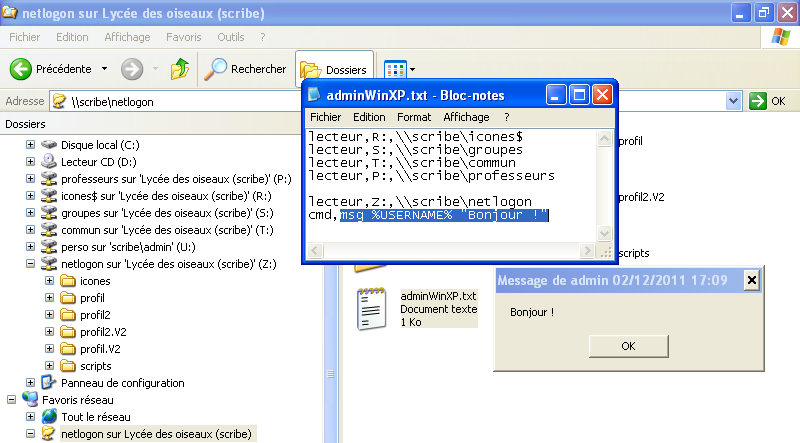

Remarque : Le programme logon.exe est lancé dans l'environnement
utilisateur, il hérite donc des droits de l'utilisateur. Cela signifie
que les commandes s'exécutent avec les droits de l'utilisateur.

## Exercices sur les sripts de netlogon

Exercice 1 : On souhaite faire en sorte que lorsque l'utilisateur
admin se connecte, si java est installé sur le poste, un message soit
affiché, sinon l'installation sera automatiquement lancée suivie d'un
message notifiant la réussite du processus. Pour cela il faudra

1.  Télécharger la version hors ligne pour windows sur
    [http://java.com/fr/download/manual.jsp](http://java.com/fr/download/manual.jsp)
    et déposer le fichier jre-xx-i586.exe sur l'emplacement réseau
    \\\\<scribe\>\\commun\\logiciels\\

2.  créer le script de netlogon
    \\\\<scribe\>\\netlogon\\scripts\\users\\admin.txt

 cmd,\\\\<scribe\>\\netlogon\\scripts\\users\\admin.bat

3.  créer le fichier batch
    \\\\<scribe\>\\netlogon\\scripts\\users\\admin.bat

if exist “%PROGRAMFILES%\\Java” goto rienafaire

\\\\<scribe\>\\commun\\logiciels\\jre-xx-i586.exe /s IEXPLORER=1
MOZILLA=1

msg %USERNAME% “Installation terminée”

goto end

:rienafaire

msg %USERNAME% “Java déjà installé”

:end

\

Remarque : Dans les lignes qui précèdent, 

-   <scribe\> est à remplacer par le nom ou l'ip du serveur scribe

-   jre-xx-i586.exe est à remplacer par le nom exact du fichier
    d'installation téléchargé.

Exercice 2 : Faites une recherche sur «freemind silent install»
pour lire comment installer en mode silencieux (càd sans interaction
avec l'utilisateur) le logiciel permettant de créer des cartes
heuristiques.

# Gestion de parc avec OCS Inventory NG

La documentation officielle en français
([http](http://wiki.ocsinventory-ng.org/index.php/Documentation:Main/fr)[://](http://wiki.ocsinventory-ng.org/index.php/Documentation:Main/fr)[wiki](http://wiki.ocsinventory-ng.org/index.php/Documentation:Main/fr)[.](http://wiki.ocsinventory-ng.org/index.php/Documentation:Main/fr)[ocsinventory](http://wiki.ocsinventory-ng.org/index.php/Documentation:Main/fr)[-](http://wiki.ocsinventory-ng.org/index.php/Documentation:Main/fr)[ng](http://wiki.ocsinventory-ng.org/index.php/Documentation:Main/fr)[.](http://wiki.ocsinventory-ng.org/index.php/Documentation:Main/fr)[org](http://wiki.ocsinventory-ng.org/index.php/Documentation:Main/fr)[/](http://wiki.ocsinventory-ng.org/index.php/Documentation:Main/fr)[index](http://wiki.ocsinventory-ng.org/index.php/Documentation:Main/fr)[.](http://wiki.ocsinventory-ng.org/index.php/Documentation:Main/fr)[php](http://wiki.ocsinventory-ng.org/index.php/Documentation:Main/fr)[/](http://wiki.ocsinventory-ng.org/index.php/Documentation:Main/fr)[Documentation](http://wiki.ocsinventory-ng.org/index.php/Documentation:Main/fr)[:](http://wiki.ocsinventory-ng.org/index.php/Documentation:Main/fr)[Main](http://wiki.ocsinventory-ng.org/index.php/Documentation:Main/fr)[/](http://wiki.ocsinventory-ng.org/index.php/Documentation:Main/fr)[fr](http://wiki.ocsinventory-ng.org/index.php/Documentation:Main/fr))
décrit en ces mots l’application :

OCS Inventory NG soit Open Computer and Software Inventory est une
application permettant de réaliser un inventaire automatisé sur la
configuration matérielle des machines du réseau et sur les logiciels qui
y sont installés. OCS permet de visualiser cet inventaire grâce à une
interface web. Il comporte également la possibilité de télé-déployer des
applicationssur un ensemble de machines selon des critères de recherche.
Une fonction des agents nommée IpDiscover, couplée à des scans snmp
permet de connaître l'intégralité des interfaces du réseau. 

## Mise en place du serveur OCS (version Linux)

On suppose que le logiciel VirtualBox
([https](https://www.virtualbox.org/)[://](https://www.virtualbox.org/)[www](https://www.virtualbox.org/)[.](https://www.virtualbox.org/)[virtualbox](https://www.virtualbox.org/)[.](https://www.virtualbox.org/)[org](https://www.virtualbox.org/)[/](https://www.virtualbox.org/))
est installé.

Nous allons ici détailler la mise en place de OCS dans un parc
informatique sous la forme d’une machine virtuelle. En configurant
correctement l'interface réseau, nous disposerons du point de vue du
réseau d’une machine à part entière qui pourra rendre tous les services
souhaités.

Avantage de la virtualisation : La simplicité, en effet sur le site
web de OCS, on trouve des images de machines virtuelles Linux pretes à
l'emploi avec OCS-serveur déjà installé et entièrement configuré.

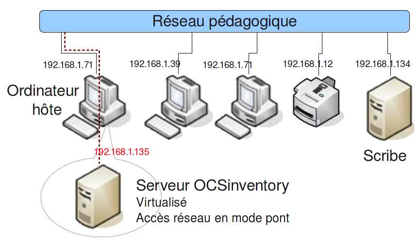\

1.  La première étape consiste à récupérer une image de machine
    virtuelle de serveur OCS

[http](http://www.ocsinventory-ng.org/en/download/download-server.html)[://](http://www.ocsinventory-ng.org/en/download/download-server.html)[www](http://www.ocsinventory-ng.org/en/download/download-server.html)[.](http://www.ocsinventory-ng.org/en/download/download-server.html)[ocsinventory](http://www.ocsinventory-ng.org/en/download/download-server.html)[-](http://www.ocsinventory-ng.org/en/download/download-server.html)[ng](http://www.ocsinventory-ng.org/en/download/download-server.html)[.](http://www.ocsinventory-ng.org/en/download/download-server.html)[org](http://www.ocsinventory-ng.org/en/download/download-server.html)[/](http://www.ocsinventory-ng.org/en/download/download-server.html)[en](http://www.ocsinventory-ng.org/en/download/download-server.html)[/](http://www.ocsinventory-ng.org/en/download/download-server.html)[download](http://www.ocsinventory-ng.org/en/download/download-server.html)[/](http://www.ocsinventory-ng.org/en/download/download-server.html)[download](http://www.ocsinventory-ng.org/en/download/download-server.html)[-](http://www.ocsinventory-ng.org/en/download/download-server.html)[server](http://www.ocsinventory-ng.org/en/download/download-server.html)[.](http://www.ocsinventory-ng.org/en/download/download-server.html)[html](http://www.ocsinventory-ng.org/en/download/download-server.html)

Une fois téléchargée, on décompacte l’archive avec un logiciel capable
de traiter les fichiers au format tar.gz, par exemple 7zip.

Nous avons maintenant à disposition un dossier contenant une image de
disque nommée

Ocsinventory-ng.vmdk. Ce fichier va nous servir de disque virtuel pour
une nouvelle machine virtuelle linux que nous allons créer dans
VirtualBox.

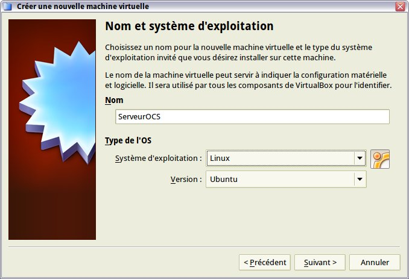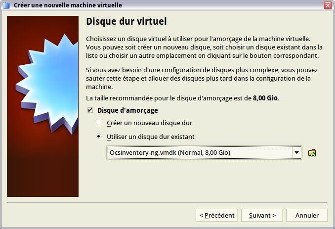

N’oubliez pas de cocher la case «Activer PAE/NX» dans l’onglet
«Processeur» de la section «Système» de votre machine virtuelle.

N’oubliez pas non plus de choisir le mode d’accès par pont pour
la carte réseau 1. Si vous voulez que votre machine virtuelle soit vue
par le réseau d’établissement et que les remontées d’inventaire puissent
se faire, c’est évidemment indispensable.

2.  Démarrons la machine, le compte administrateur est comme d’habitude
    «root» et le mot de passe est ici «ocs». Nous pourrions le changer
    après connexion avec la commande passwd.

3.  Premère étape : effectuer le réglage du clavier pour passez en
    azerty :

root@ocsinventory-ng:\~\# loadkeys
fr

2.  Deuxième étape régler les paramètres réseau de la machine avec
    l’éditeur de texte nano.

INFO : Sous nano, pour enregistrer : <CTRL\>+O+<Entrée\>

pour quitter : <CTRL\>+X

Premier fichier : /etc/network/interfaces , il contient les paramètres
des interfaces réseau

root@ocsinventory-ng:\~\# nano
/etc/network/interfaces

Par défaut il est réglé sur une ip fixe 10.10.10.10, nous allons
modifier cela

auto eth0

iface eth0 inet static

address 192.168.1.205

netmask 255.255.255.0

broadcast 192.168.1.255

gateway 192.168.1.1

Si vous vouliez configurer le serveur pour qu’il reçoive une adresse ip
par le serveur DHCP :

auto eth0

iface eth0 inet dhcp

\

Second fichier : /etc/resolv.conf , il contient les adresses des
serveurs DNS.

root@ocsinventory-ng:\~\# nano
/etc/resolv.conf

nameserver 212.27.40.241

nameserver 212.27.40.240

\

Troisième fichier : /etc/hosts , il contient une liste d'association
etntre nom de machine et adresse IP qui passera avant la résolution de
nom classique par DNS.

root@ocsinventory-ng:\~\# nano
/etc/hosts

127.0.0.1 localhost

129.168.1.205 ocsinvetory-ng

2.  Le plus simple est maintenant de redémarrer la machine pour qu’elle
    prenne en compte les nouveaux paramètres.

root@ocsinventory-ng:\~\# reboot

Pour tester le fonctionnement on peut ouvrir, sur un client windows, un
navigateur à l’adresse

[http://ocsinventory-ng/ocsreports](http://ocsinventory-ng/ocsreports)
ou
[http://ip\_du\_serveur\_ocs/ocsreports](http://ip_du_serveur_ocs/ocsreports)

Pour se connecter, user:admin et password:admin.

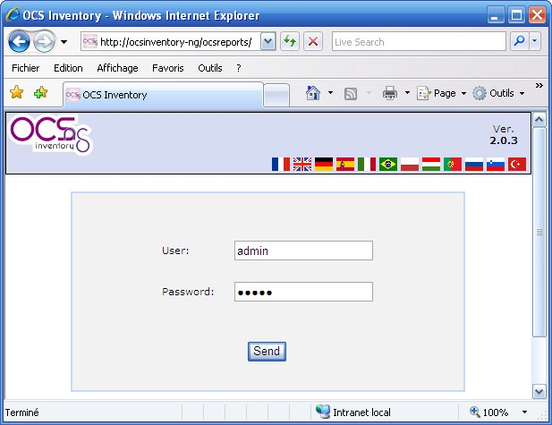

## Installation de l’agent OCS sur les clients

Sur le client windows, téléchargez l’agent windows sur la page de
téléchargement du site OCS :

[http](http://www.ocsinventory-ng.org/en/download/download-agent.html)[://](http://www.ocsinventory-ng.org/en/download/download-agent.html)[www](http://www.ocsinventory-ng.org/en/download/download-agent.html)[.](http://www.ocsinventory-ng.org/en/download/download-agent.html)[ocsinventory](http://www.ocsinventory-ng.org/en/download/download-agent.html)[-](http://www.ocsinventory-ng.org/en/download/download-agent.html)[ng](http://www.ocsinventory-ng.org/en/download/download-agent.html)[.](http://www.ocsinventory-ng.org/en/download/download-agent.html)[org](http://www.ocsinventory-ng.org/en/download/download-agent.html)[/](http://www.ocsinventory-ng.org/en/download/download-agent.html)

Après avoir dézippé l’archive
[OCSNG](http://launchpad.net/ocsinventory-windows-agent/2.0/2.0.3/+download/OCSNG-Windows-Agent-2.0.3.zip)[-](http://launchpad.net/ocsinventory-windows-agent/2.0/2.0.3/+download/OCSNG-Windows-Agent-2.0.3.zip)[Windows](http://launchpad.net/ocsinventory-windows-agent/2.0/2.0.3/+download/OCSNG-Windows-Agent-2.0.3.zip)[-](http://launchpad.net/ocsinventory-windows-agent/2.0/2.0.3/+download/OCSNG-Windows-Agent-2.0.3.zip)[Agent](http://launchpad.net/ocsinventory-windows-agent/2.0/2.0.3/+download/OCSNG-Windows-Agent-2.0.3.zip)[-2.0.3.](http://launchpad.net/ocsinventory-windows-agent/2.0/2.0.3/+download/OCSNG-Windows-Agent-2.0.3.zip)[zip](http://launchpad.net/ocsinventory-windows-agent/2.0/2.0.3/+download/OCSNG-Windows-Agent-2.0.3.zip)
vous obtenez un dossier dans lequel vous exécutez le programme
OCS-NG-Windows-Agent-Setup.exe

Lors du choix des composants, veillez à bien laisser cochée la case
«Network inventory» car nous voulons que l’inventaire soit envoyé au
serveur.

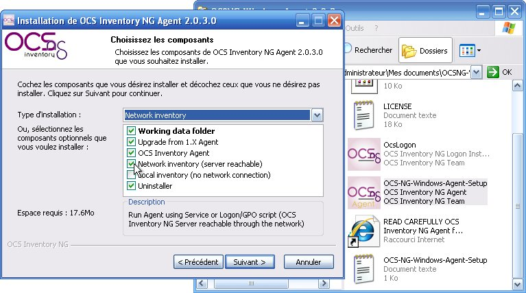

L’étape suivante permet de régler la connexion au serveur dont le nom
d’hôte a été fixé plus haut à «ocsinventory-ng». Il n’y a donc rien à
modifier à la valeur par défaut de l’URL du serveur. La validation du
certificat se fera en pointant vers le fichier partagé sur le serveur
OCS :

\\\\ocsinventory-ng\\ocs$\\cacert.pem.

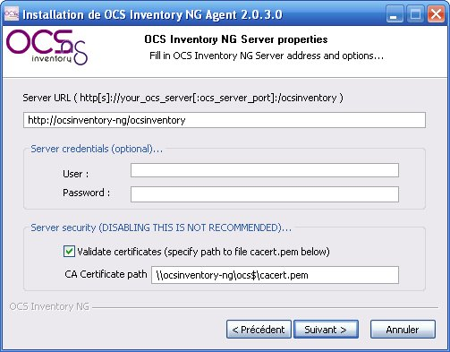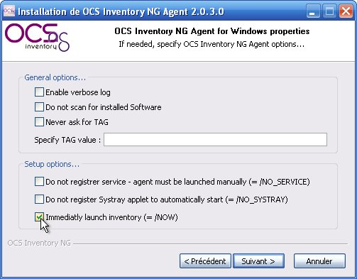

Dernière étape : demander qu’une remontée de l’inventaire soit effectuée
lors de l’installation. Sans cela, il faudra attendre jusqu’à 48h pour
voir apparaître la machine dans l’interface de gestion centralisée.

\

Rendez-vous à l’adresse
[http](http://ocsinventory-ng/ocsreports)[://](http://ocsinventory-ng/ocsreports)[ocsinventory](http://ocsinventory-ng/ocsreports)[-](http://ocsinventory-ng/ocsreports)[ng](http://ocsinventory-ng/ocsreports)[/](http://ocsinventory-ng/ocsreports)[ocsreports](http://ocsinventory-ng/ocsreports)
ou
[http://ip\_du\_serveur\_ocs/ocsreports](http://ip_du_serveur_ocs/ocsreports),
vous devriez voir l’inventaire du poste en cliquant sur l’icône
ordinateur.

\

\

## Déploiement de paquets sur le parc

C’est une fonctionnalité essentielle mais qui nécessite un peu de
pratique. Essayons-nous sur un cas pratique : l’installation sur le parc
d’un petit logiciel de lecture de pdf : SumatraPDF.

On récupère l’installeur sur la page de téléchargement

[http](http://blog.kowalczyk.info/software/sumatrapdf/download-free-pdf-viewer.html)[://](http://blog.kowalczyk.info/software/sumatrapdf/download-free-pdf-viewer.html)[blog](http://blog.kowalczyk.info/software/sumatrapdf/download-free-pdf-viewer.html)[.](http://blog.kowalczyk.info/software/sumatrapdf/download-free-pdf-viewer.html)[kowalczyk](http://blog.kowalczyk.info/software/sumatrapdf/download-free-pdf-viewer.html)[.](http://blog.kowalczyk.info/software/sumatrapdf/download-free-pdf-viewer.html)[info](http://blog.kowalczyk.info/software/sumatrapdf/download-free-pdf-viewer.html)[/](http://blog.kowalczyk.info/software/sumatrapdf/download-free-pdf-viewer.html)[software](http://blog.kowalczyk.info/software/sumatrapdf/download-free-pdf-viewer.html)[/](http://blog.kowalczyk.info/software/sumatrapdf/download-free-pdf-viewer.html)[sumatrapdf](http://blog.kowalczyk.info/software/sumatrapdf/download-free-pdf-viewer.html)[/](http://blog.kowalczyk.info/software/sumatrapdf/download-free-pdf-viewer.html)[download](http://blog.kowalczyk.info/software/sumatrapdf/download-free-pdf-viewer.html)[-](http://blog.kowalczyk.info/software/sumatrapdf/download-free-pdf-viewer.html)[free](http://blog.kowalczyk.info/software/sumatrapdf/download-free-pdf-viewer.html)[-](http://blog.kowalczyk.info/software/sumatrapdf/download-free-pdf-viewer.html)[pdf](http://blog.kowalczyk.info/software/sumatrapdf/download-free-pdf-viewer.html)[-](http://blog.kowalczyk.info/software/sumatrapdf/download-free-pdf-viewer.html)[viewer](http://blog.kowalczyk.info/software/sumatrapdf/download-free-pdf-viewer.html)[.](http://blog.kowalczyk.info/software/sumatrapdf/download-free-pdf-viewer.html)[html](http://blog.kowalczyk.info/software/sumatrapdf/download-free-pdf-viewer.html)

le fichier se nomme SumatraPDF-1.9-Install.exe. On pourrait lancer
l’installation en éxécutant cette commande dans une fenêtre DOS. Comme
par ailleurs il est possible d’installer en mode silencieux (sans
questions) avec l’option /S, ocsinventory n’aura aucun mal à déployer ce
logiciel sur le parc en exécutant la commande
SumatraPDF-1.9-Install.exe /S après l’avoir déposé sur chaque poste.

\

1.  Il faut commencer par compresser le fichier
    SumatraPDF-1.9-Install.exe avant de pouvoir le déployer. Il suffit
    pour cela d’un clic-droit -\> Envoyer vers -\> Dossier compressé.

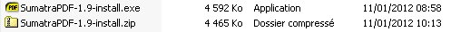

2.  Maintenant, dans l’interface web ocsinventory, nous allons
    construire le paquet.

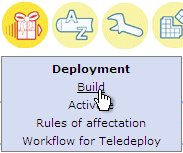

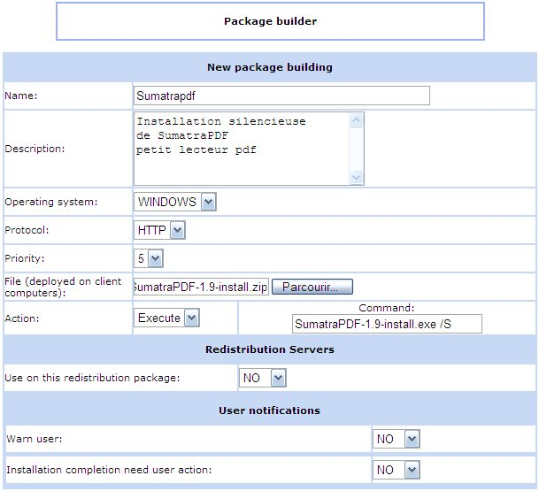

Le fichier à déployer est l’archive .zip que nous avons créée. L’action
est «Execute» puisque on souhaite exécuter le fichier
SumatraPDF-1.9-Install.exe et pour éviter que l’installation intéragisse
avec l’utilisateur sur le poste client, on ajoute l’option /S pour une
installation silencieuse avec les options par défaut.

3.  Il nous faut maintenant activer le paquet. Pour cela, afficher la
    page d’activation et cliquer sur l’icône comme sur l’image
    ci-dessous :

Choisir alors l’activation manuelle puis valider.

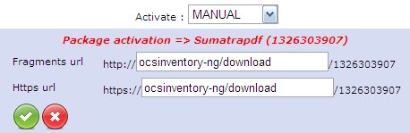

4.  À présent le paquet est prêt, il reste à choisir les postes sur
    lesquels on souhaite déployer. Pour cela, cliquez sur l’icône de
    recherche puis «Search with various criteria». Dans l’exemple
    ci-dessous, le paramètre choisi est «Computers : Operating systems».

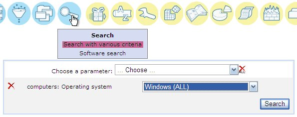

5.  On peut alors choisir en les cochant les postes sur lesquels on va
    déployer le paquet

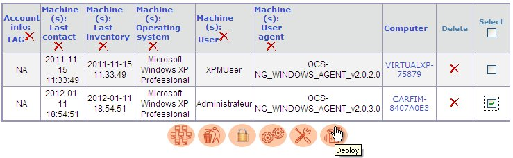

6.  Après avoir cliqué sur l’icône de déploiement, préciser que
    l’affectation se fera pour la sélection puis cliquer sur le bouton
    «SELECT» correspondant au paquet à déployer.

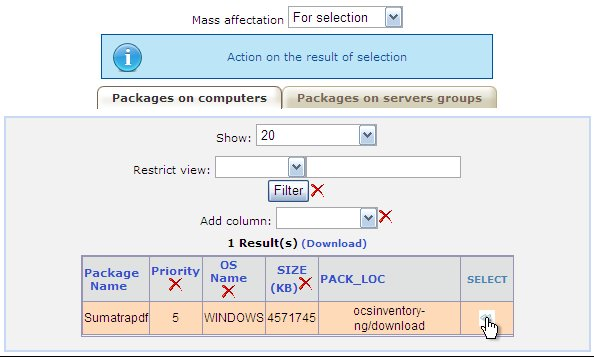

C’est terminé. À partir de maintenant, lorsque l’agent du poste client
va contacter le serveur, celui-ci va enregistrer une notification et
sera alors prêt à déployer le paquet au bout d’un temps aléatoire
pouvant aller jusqu’à 24h. On peut suivre l’avancement des déploiements
en cliquant sur Deployment-\>Activate

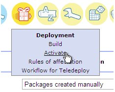

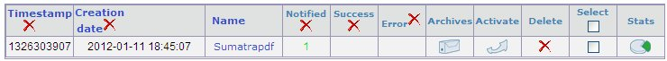

\

Pour aller (beaucoup) plus loin, la documentation est très complète :

[http](http://wiki.ocsinventory-ng.org/index.php/Documentation:Teledeploy/fr)[://](http://wiki.ocsinventory-ng.org/index.php/Documentation:Teledeploy/fr)[wiki](http://wiki.ocsinventory-ng.org/index.php/Documentation:Teledeploy/fr)[.](http://wiki.ocsinventory-ng.org/index.php/Documentation:Teledeploy/fr)[ocsinventory](http://wiki.ocsinventory-ng.org/index.php/Documentation:Teledeploy/fr)[-](http://wiki.ocsinventory-ng.org/index.php/Documentation:Teledeploy/fr)[ng](http://wiki.ocsinventory-ng.org/index.php/Documentation:Teledeploy/fr)[.](http://wiki.ocsinventory-ng.org/index.php/Documentation:Teledeploy/fr)[org](http://wiki.ocsinventory-ng.org/index.php/Documentation:Teledeploy/fr)[/](http://wiki.ocsinventory-ng.org/index.php/Documentation:Teledeploy/fr)[index](http://wiki.ocsinventory-ng.org/index.php/Documentation:Teledeploy/fr)[.](http://wiki.ocsinventory-ng.org/index.php/Documentation:Teledeploy/fr)[php](http://wiki.ocsinventory-ng.org/index.php/Documentation:Teledeploy/fr)[/](http://wiki.ocsinventory-ng.org/index.php/Documentation:Teledeploy/fr)[Documentation](http://wiki.ocsinventory-ng.org/index.php/Documentation:Teledeploy/fr)[:](http://wiki.ocsinventory-ng.org/index.php/Documentation:Teledeploy/fr)[Teledeploy](http://wiki.ocsinventory-ng.org/index.php/Documentation:Teledeploy/fr)[/](http://wiki.ocsinventory-ng.org/index.php/Documentation:Teledeploy/fr)[fr](http://wiki.ocsinventory-ng.org/index.php/Documentation:Teledeploy/fr)

# 8. Cloud computing avec eyeOS

\

EyeOS est un webOS (système d’exploitation sur le web)

qui propose un bureau virtuel assez complet dans le cloud.

Il permet de présenter, d’organiser et de gérer les données,

les fichiers et les applications de l’utilisateur.

\

L’installation d’un site web sur notre serveur linux OCSinventory sous
ubuntu se fait dans le répertoire servi par le serveur web apache2 :
/var/www

Nous nous déplaçons donc dans ce répertoire :

\# cd /var/www

Créons tout de suite un répertoire eyeos qui va recevoir les fichiers
que nous allons télécharger

\# mkdir eyeos

On peut maintenant télécharger l’archive sous le nom eyeos.tgz

\# wget -O eyeos.tgz
http://sourceforge.net/projects/eyeos/files/eyeos2/eyeos-2.5.tar.gz/download

le fichier reçu est une archive que l’on peut décompresser avec la
commande

\# tar -zxf eyeos.tgz

\

En faisant pointer un navigateur à l’adresse
[http](http://ocsinventory-ng/ocsreports)[://](http://ocsinventory-ng/ocsreports)[ocsinventory](http://ocsinventory-ng/ocsreports)[-](http://ocsinventory-ng/ocsreports)[ng](http://ocsinventory-ng/ocsreports)[/](http://ocsinventory-ng/ocsreports)[eyeos](http://ocsinventory-ng/ocsreports)
ou
[http](http://ip_du_serveur/eyeos)[://](http://ip_du_serveur/eyeos)[ip](http://ip_du_serveur/eyeos)[\_](http://ip_du_serveur/eyeos)[du](http://ip_du_serveur/eyeos)[\_](http://ip_du_serveur/eyeos)[serveur](http://ip_du_serveur/eyeos)[/](http://ip_du_serveur/eyeos)[eyeos](http://ip_du_serveur/eyeos)
on constate que l’installation va demander encore un peu de travail.

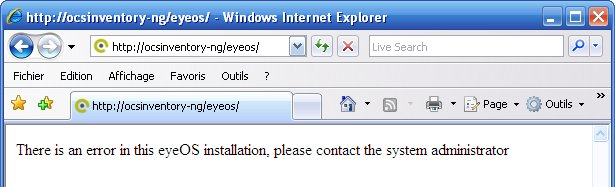

\

La documentation indique que sur certains dossiers et fichiers du
répertoire d’installation le serveur apache doit avoir tous les droits.
Le nom de l’utilisateur en charge du service apache est www-data. nous
allons donc lui donner les droits complets sur l’ensemble de
l’arborescence.

Commençons par le rendre propriétaire

\# chown -R
www-data.www-data \

puis donnons-lui les droits

\# chmod -R 775 \

\

Pour puis laner l’installation, rendons-nous maintenant à l’adresse
[http](http://ocsinventory-ng/ocsreports)[://](http://ocsinventory-ng/ocsreports)[ocsinventory](http://ocsinventory-ng/ocsreports)[-](http://ocsinventory-ng/ocsreports)[ng](http://ocsinventory-ng/ocsreports)[/](http://ocsinventory-ng/ocsreports)[eyeos](http://ocsinventory-ng/ocsreports)[/](http://ocsinventory-ng/ocsreports)[install](http://ocsinventory-ng/ocsreports)[/](http://ocsinventory-ng/ocsreports)
ou
[http](http://ip_du_serveur/eyeos)[://](http://ip_du_serveur/eyeos)[ip](http://ip_du_serveur/eyeos)[\_](http://ip_du_serveur/eyeos)[du](http://ip_du_serveur/eyeos)[\_](http://ip_du_serveur/eyeos)[serveur](http://ip_du_serveur/eyeos)[/](http://ip_du_serveur/eyeos)[eyeos](http://ip_du_serveur/eyeos)[/](http://ip_du_serveur/eyeos)[instal](http://ip_du_serveur/eyeos)l.
Il y a encore quelques problèmes à régler.

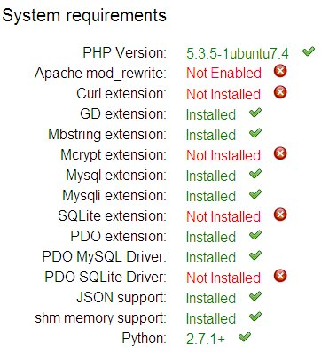

-   mod\_rewrite est un module du serveur web apache qui permet de
    réécrire des url à la volée. Il faut le charger

\# a2enmod rewrite

il est nécessaire de redémarrer le service apache pour prendre en compte
le chargement du module

\# /etc/init.d/apache2 restart

-   Le paquet contenant l’extension curl doit être chargé. Pour savoir
    quel paquet installer interrogeons la base de données des paquets
    installables:

\# apt-cache search curl

le paquet php5-curl semble être un bon candidat pour une application php
réclamant curl. On l’installe avec la commande apt-get install

\# apt-get install php5-curl

\

Exercice : Recherchez puis installez les paquets
manquants jusqu’à ce que le prérequis
système soit complet. Remarque rechargez la
page web après chaque installation de paquet
pour voir les progrès et n’hésitez pas
à relancer le serveur apache avant de
conclure que votre installation n’a pas
réglé le problème.

Vous pouvez noter ici les noms des
paquets que vous avez installé :

…..................…..................…..................…..................…..................…..................….....................

\

…..................…..................…..................…..................…..................…..................….....................

\

Lorsque tous les problèmes de dépendance sont réglés, on peut passer à
la page suivante qui demande comment se connecter à la base de données
qui va servir à eyeOS.

Il nous faut créer cette base. Connectons-nous en tant qu’utilisateur
root sur MySQL.

\# mysql -u root -p

Saisissez le mot passe «ocs»

mysql\> create database eyeos;

mysql\> quit

\

Il ne reste plus qu’à terminer l’installation

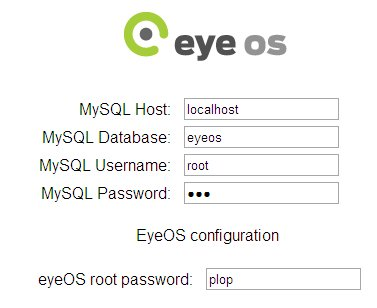

\

\

Connectez-vous en tant que «root» avec le mot de passe «plop» choisi
ci-dessus.

\

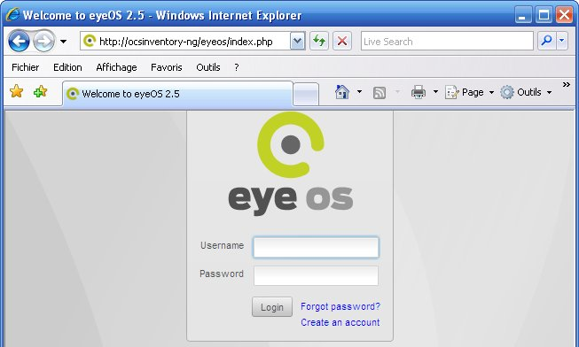

\

Bienvenue dans le cloud computing !

\

Page 32 sur 32
