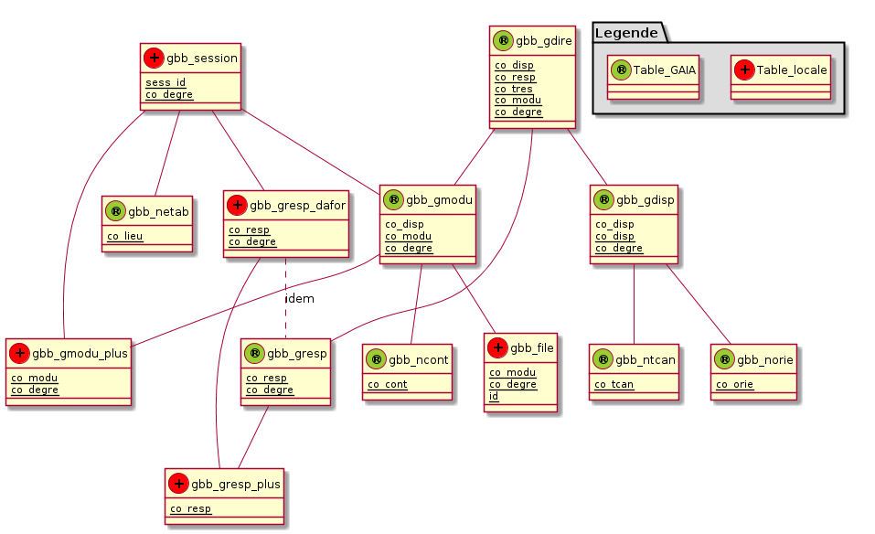

%GaiaBB
%Documentation Technique du module Drupal
%N. Poulain

<!-- Commande pour générer le pdf
file=README && java -jar ../../asciiArt/plantuml.jar $file.md && pandoc-1.9.1.2 --toc --number-sections --smart -s $file.md -o $file.pdf &&  evince $file.pdf
-->

Git
===

Ajout d'un nouveau fichier
--------------------------

Après ajout du nouveau fichier `FILE` dans le module gaiabb, on crée un lien
matériel vers dropbox puis on l'ajoute dans git.

`$ cd ~/Dropbox/gaiabb`
`$ ln /var/www/drupal-7.14/sites/default/modules/gaiabb/FILE FILE`
`$ git add FILE`

Commmiter des changements
-------------------------

le but est de créer un commit puis de 
tranférer vers http://code.google.com/p/npoulain/source/browse/

`$ git commit -a -m "Ajout du fichier FILE"` && git push google master`

Le module GaiaBB
================
Il est placé dans le dossier `sites/default/modules/`
de l'arborescence drupal.
Le dossier `sites/default/modules/gaiabb` contient notamment

* `gaiabb.info` (fichier de description du module)
* `gaiabb.module`

Scripts de mise à jour de la base de données
============================================

Le dossier unl_mysql contenu dans le dossier gaiabb
contient les scripts relatifs à la mise à jour de la base
de données :

`unl2sql.sh`
------------
  
Création du fichier `FILE.SQL` depuis `FILE.unl` possédant N champs. 
Le fichier est converti de UTF-8 vers ISO-8859-15 puis
nettoyé, les sauts de ligne sont supprimés. Le fichier SQL est créé.

`root@ks:# ./unl2sql FILE N`

`unlChecker.sh`
---------------

Verification de validité de FILE.unl et log des résultats. 
On vérifie que `CHAMPS_ATTENDUS = CHAMPS` et que `POIDS_MIN < POIDS`.

`root@ks:# ./unlChecker.sh FILE CHAMPS_ATTENDUS CHAMPS POIDS_MIN POIDS`

`GaiaBBupdateSQL.sh`
--------------------

C'est le script principal à lancer dans le cadre d'une mise à jour automatisée
par cron.
Il Lance la mise à jour des tables gaia lues par le module gaiaBB.
Lance aussi les  sauvegardes.

* `-n`  Nettoie en supprimant les fichiers .unl
* `-g`  Récupère par GET FTP les fichiers au format unl.
* `-m`  Lance le script unl2sql sur chacun des fichier unl afin de les traduire 
  en lignes d'injection SQL puis lance les injections

Voici un exemple d'utilisation et la sortie associée. 
On constate ici que la mise à jour de la table gmodu de GAIA a rencontré
un problème qui est analysé dans le rapport de sortie daté du jour : 
le poids du fichier est plus petit qu'attendu. 
Le fichier ETAT.log conserve la trace des rapports de sortie au format csv.

~~~
root@ks:# ./GaiaBBupdateSQL.sh -ngm
Usage: GaiaBBupdateSQL.sh [-n nettoyage] [-g getFPT] [-m mysqlInjections]
_N_etttoyage du dossier
_G_et FTP des donnees
.../sites/default/modules/gaiabb/unl_mysql/gdisp.unl:    6.49 MB    6.54 MB/s  
.../sites/default/modules/gaiabb/unl_mysql/gmodu.unl:   21.21 MB    4.71 MB/s  
.../sites/default/modules/gaiabb/unl_mysql/gdire.unl:  936.49 kB    8.74 MB/s  
.../sites/default/modules/gaiabb/unl_mysql/gresp.unl:  638.41 kB    8.07 MB/s  
.../sites/default/modules/gaiabb/unl_mysql/ncont.unl:    7.61 kB  415.51 kB/s  
.../sites/default/modules/gaiabb/unl_mysql/ntcan.unl:  185.00 B    28.91 kB/s  
.../sites/default/modules/gaiabb/unl_mysql/norie.unl:   25.53 kB  993.44 kB/s  
Injections _M_YSQL après amélioration des données
* gmodu.unl en traitement par unl2sql ...               fait.
                                                        ERROR
* gdisp.unl en traitement par unl2sql ...               fait.
* gdisp.SQL en cours d'injection  .....                 fait.

* gresp.unl en traitement par unl2sql ...               fait.
* gresp.SQL en cours d'injection  .....                 fait.

* gdire.unl en traitement par unl2sql ...               fait.
* gdire.SQL en cours d'injection  .....                 fait.

* ncont.unl en traitement par unl2sql ...               fait.
* ncont.SQL en cours d'injection  .....                 fait.

* ntcan.unl en traitement par unl2sql ...               fait.
* ntcan.SQL en cours d'injection  .....                 fait.

* norie.unl en traitement par unl2sql ...               fait.
* norie.SQL en cours d'injection  .....                 fait.

2012-06-10 18:21:14 ; gmodu ; Erreur ; Nb champs : 40 = 40 ; Poids : 37 < 5
2012-06-10 18:21:17 ; gdisp ; OK ; Nb champs : 29 = 29 ; Poids : 8000 < 8128
2012-06-10 18:21:26 ; gresp ; OK ; Nb champs : 18 = 18 ; Poids : 960 < 984
2012-06-10 18:21:30 ; gdire ; OK ; Nb champs : 6 = 6 ; Poids : 2650 < 2876
2012-06-10 18:21:45 ; ncont ; OK ; Nb champs : 6 = 6 ; Poids : 11 < 16
2012-06-10 18:21:45 ; ntcan ; OK ; Nb champs : 6 = 6 ; Poids : 3 < 4
2012-06-10 18:21:45 ; norie ; OK ; Nb champs : 6 = 6 ; Poids : 39 < 40
Il n'y a plus de paramètre
~~~

Tables ajoutées à la base de données drupal
===========================================

<!--
@startuml BDDsimple.png

package "Legende" #DDDDDD {
  Table_locale << (+,Red) >>
  Table_GAIA << (®,YellowGreen) >>  
}

gbb_gmodu -- gbb_ncont
gbb_gmodu -- gbb_file
gbb_gmodu -- gbb_gmodu_plus
gbb_session -- gbb_gmodu
gbb_session -- gbb_gmodu_plus
gbb_session -- gbb_gresp_dafor
gbb_session -- gbb_netab

gbb_gresp_dafor .. gbb_gresp : idem
gbb_gresp_dafor -- gbb_gresp_plus
gbb_gresp -- gbb_gresp_plus

gbb_gdire -- gbb_gmodu
gbb_gdire -- gbb_gresp
gbb_gdire -- gbb_gdisp

gbb_gdisp -- gbb_norie
gbb_gdisp -- gbb_ntcan

gbb_gdire << (®,YellowGreen) >>
class gbb_gdire {
  {static} co_disp
  {static} co_resp
  {static} co_tres
  {static} co_modu
  {static} co_degre
}

gbb_gdisp << (®,YellowGreen) >>
class gbb_gdisp {
  co_disp
  {static} co_disp
  {static} co_degre
}

gbb_gmodu << (®,YellowGreen) >> 
class gbb_gmodu {
  co_disp
  {static} co_modu
  {static} co_degre
}

gbb_gresp << (®,YellowGreen) >> 
class  gbb_gresp {
  {static} co_resp
  {static} co_degre
}

gbb_ncont << (®,YellowGreen) >>
class gbb_ncont {
  {static} co_cont
}

gbb_netab << (®,YellowGreen) >>
class gbb_netab{
  {static} co_lieu
}

gbb_norie << (®,YellowGreen) >>
class gbb_norie {
  {static} co_orie
}

gbb_ntcan << (®,YellowGreen) >>
class gbb_ntcan {
  {static} co_tcan
}

gbb_session << (+,Red) >>
class gbb_session {
  {static} sess_id
  {static} co_degre
}

gbb_gresp_dafor << (+,Red) >> 
class  gbb_gresp_dafor {
  {static} co_resp
  {static} co_degre
}

gbb_gmodu_plus << (+,Red) >>
class gbb_gmodu_plus {
  {static} co_modu
  {static} co_degre
}

gbb_file << (+,Red) >>
class gbb_file {
  {static} co_modu
  {static} co_degre
  {static} id
}

gbb_gresp_plus << (+,Red) >>
class gbb_gresp_plus {
  {static} co_resp
}
@enduml
-->

gbb\_file         TYPE      Max   Null Key Deflt  Comment
---------------   --------- ---   ---- --- ------ --------
co\_modu          int       NULL  NO       0      Code du module pour un dispositif donné
co\_degre         smallint  NULL  NO       2      Code du degré
fid               smallint  NULL  NO       NULL   Clé étrangère avec table file\_managed

gbb\_gdire        TYPE      Max   Null Key Deflt  Comment
---------------   --------- ---   ---- --- ------ --------
co\_disp          int       NULL  NO   PRI NULL   Code interne du dispositif
co\_resp          int       NULL  NO   PRI NULL   Code responsable
co\_tres          char      1     NO   PRI NULL   code du type de responsable
co\_modu          int       NULL  NO   PRI 0      Code du module pour un dispositif donné
co\_degre         smallint  NULL  NO   PRI 2      Code du degré

gbb\_gdisp        TYPE      Max   Null Key Deflt  Comment
---------------   --------- ---   ---- --- ------ --------
co\_disp          int       NULL  NO   PRI NULL   Code interne du dispositif
id\_disp          char      10    NO   MUL NULL   Identifiant du dispositif
lib               char      50    YES      NULL   Libellé
libl              char      250   YES      NULL   Libellé long
co\_objt          char      2     YES      NULL   Code de l objectif de formation
co\_init          char      2     YES      NULL   Code du niveau d initiative
co\_tcan          char      1     YES      NULL   Code du type de candidature
nb\_place\_prev   smallint  NULL  YES      NULL   Nombre de places prévues
duree\_prev       smallint  NULL  YES      NULL   Durée moyenne estimée par personne
nb\_mod\_prev     smallint  NULL  YES      NULL   Nombre de modules prévus
co\_chap          char      4     YES      NULL   Code du chapitre de prévision
co\_art           char      2     YES      NULL   Code article de prévision
dt\_crea          date      NULL  YES      NULL   date de création
ty\_crea          char      1     YES      NULL   Type de création
co\_camp          char      2     YES      NULL   Code de la campagne
co\_them          char      2     YES      NULL   Code du thème du dispositif
co\_andi          char      2     YES      NULL   Code du type d annulation du dispositif--
lobjt             text      65535 YES      NULL   Objectif littéral
co\_orga          int       NULL  YES      NULL   Code de l organisme
co\_offre         int       NULL  YES      NULL   Code interne de l offre
co\_orie          char      4     YES      NULL   Code nomenclature locale d orientation 
gestionnaire      char      50    YES      NULL   Gestionnaire en charge du dispositif
co\_tpla          char      1     YES      NULL   Code type de plan
co\_offreur       char      8     YES      NULL   Code offreur
code\_om\_stag    char      2     YES      NULL   Code du modèle choisi pour l OM stagiaire
code\_remu        char      2     YES      NULL   code du modèle choisi pour la fiche de rémunération
code\_om\_interv  char      2     YES      NULL   code du modèle choisi pou l OM intervenant
co\_degre         smallint  NULL  NO   PRI 2      Code du degré

gbb\_gmodu        TYPE      Max   Null Key Deflt  Comment
---------------   --------- ---   ---- --- ------ --------
co\_disp          int       NULL  NO   MUL NULL   Code interne du dispositif
co\_modu          int       NULL  NO   PRI NULL   Code du module pour un dispositif donné
co\_type          char      1     YES      NULL   type du module
lib               char      50    YES      NULL   Libellé
libl              char      150   YES      NULL   Libellé long
co\_cont          char      3     YES      NULL   Code contenu
co\_form          char      1     YES      NULL   Code forme
co\_moda          char      1     YES      NULL   Code modalité
co\_cibl          char      2     YES      NULL   Code du public cible
duree\_prev       smallint  NULL  YES      NULL   Durée moyenne estimée par personne
nb\_place\_prev   smallint  NULL  YES      NULL   Nombre de places prévues
nb\_interv        smallint  NULL  YES      NULL   Nombre d intervenant
nb\_h\_interv     smallint  NULL  YES      NULL   Nombre d heures d intervention
co\_regr          char      6     YES      NULL   Code regroupement
conv              char      1     YES      NULL   Flag convention ? O/N
co\_prac          char      2     YES      NULL   Code priorité académique
co\_prna          char      2     YES      NULL   Code priorité nationale
co\_budg          char      3     YES      NULL   Code budget
dt\_crea          date      NULL  YES      NULL   date de création
cumul             char      1     YES      NULL   cumul pour le 1 degré si plus 36 semaines
lcont             text      65535 YES      NULL   Contenu littéral
lmoda             text      65535 YES      NULL   modalité littérale
lcibl             text      65535 YES      NULL   Cible littérale
lautre            text      65535 YES      NULL   Autre zone littérale
co\_anmo          char      2     YES      NULL   Code du type d annulation des modules
co\_remp          char      1     YES      NULL   code de remplacement 1er degré
co\_omodu         int       NULL  YES      NULL   code du module de l offre
lpeda             char      250   YES      NULL   Descriptif de l objectif pédagogique
lform             char      250   YES      NULL   Description littérale de la forme
nb\_groupe        smallint  NULL  YES      NULL   Nombre de groupes possible
nb\_eff\_groupe   smallint  NULL  YES      NULL   Effectif par groupe
cout\_p\_fonc     decimal   NULL  YES      NULL   cout prévisionnel de fonctionnement par groupe
cout\_p\_prest    decimal   NULL  YES      NULL   cout prévisionnel de prestation par groupe
cout\_p\_excep    decimal   NULL  YES      NULL   cout prévisionnel des frais exceptionnels
co\_affich\_org   char      1     NO       NULL   Code affichage des organisations prévisionnelles -arborescence plan (O/N)
lcomm             char      250   YES      NULL   Commentaires
co\_etab\_dem     char      8     YES      NULL   Code de l établissement demandeur
publie            char      1     YES      NULL   Publication des demandes
co\_degre         smallint  NULL  NO   PRI 2      Code du degré

gbb\_gmodu\_plus  TYPE      Max   Null Key Deflt  Comment
---------------   --------- ---   ---- --- ------ --------
co\_modu          int       NULL  NO   PRI NULL   Code du module pour un dispositif donné
co\_degre         smallint  NULL  NO   PRI 2      Code du degré
module\_alert     tinyint   NULL  YES      0      Alerte sur le module : service administratif prévenu d un changt important.
prioritaire       tinyint   NULL  YES      0      Prioritaire
module\_printed   tinyint   NULL  YES      0      L ensemble des convocations a été imprimé.
organisation      text      65535 YES      NULL   Journal de bord
CDC\_etat         tinyint   NULL  YES      0      Le CDC a-t-il été transmis au CE ?
convoc\_info\_off text      65535 YES      NULL   Info à ne pas porter sur la convocation 
convoc\_info\_on  text      65535 YES      NULL   Info à porter sur la convocation 
LE\_etat          tinyint   NULL  YES      0      Listes d émargement transmises
LE\_info          text      65535 YES      NULL   Infos à propos des listes d émargement
DSF\_etat         tinyint   NULL  YES      0      Déclaration de Service Fait transmises
DSF\_info         text      65535 YES      NULL   Infos à propos des Déclaration de Service Fait 
DA\_info          text      65535 YES      NULL   Infos à propos du Dossier Administratif
DA\_date\_depot   datetime  NULL  NO       1970... Date de dépot du dossier administratif

gbb\_gresp        TYPE      Max   Null Key Deflt  Comment
---------------   --------- ---   ---- --- ------ --------
co\_resp          int       NULL  NO   PRI NULL   Code responsable
id\_resp          char      5     YES      NULL   Identifiant du responsable
qualite           char      60    YES      NULL   Qualité du responsable (fonction)
num\_voie         char      4     YES      NULL   Numéro de la voie
nat\_voie         char      4     YES      NULL   Nature de la voie
des\_voie         char      20    YES      NULL   adresse
esc\_res          char      30    YES      NULL   escalier - résidence
cp                char      5     YES      NULL   code postal
vil               char      30    YES      NULL   Ville
tel               char      14    YES      NULL   Téléphone
fax               char      14    YES      NULL   fax
mel               char      60    YES      NULL   mail
organ             char      60    YES      NULL   Organisme
nomu              char      20    YES      NULL   Nom d usage
prenom            char      15    YES      NULL   Prénom de la personne
civilite          char      1     YES      NULL   Civilité
co\_degre         smallint  NULL  NO   PRI 2      Code du degré

gbb\_gresp\_dafor TYPE      Max   Null Key Deflt  Comment
---------------   --------- ---   ---- --- ------ --------
co\_resp          int       NULL  NO   PRI NULL   Code responsable
id\_resp          char      5     YES      NULL   Identifiant du responsable
qualite           char      60    YES      NULL   Qualité du responsable (fonction)
num\_voie         char      4     YES      NULL   Numéro de la voie
nat\_voie         char      4     YES      NULL   Nature de la voie
des\_voie         char      20    YES      NULL   adresse
esc\_res          char      30    YES      NULL   escalier - résidence
cp                char      5     YES      NULL   code postal
vil               char      30    YES      NULL   Ville
tel               char      14    YES      NULL   Téléphone
fax               char      14    YES      NULL   fax
mel               char      60    YES      NULL   mail
organ             char      60    YES      NULL   Organisme
nomu              char      20    YES      NULL   Nom d usage
prenom            char      15    YES      NULL   Prénom de la personne
civilite          char      1     YES      NULL   Civilité
co\_degre         smallint  NULL  NO   PRI 2      Code du degré

gbb\_gresp\_plus  TYPE      Max   Null Key Deflt  Comment
---------------   --------- ---   ---- --- ------ --------
co\_resp          int       NULL  NO   PRI NULL   Code responsable
resp\_dafor       varchar   10    NO       NULL   Initiales du conseiller responsable
discipline        varchar   100   NO       NULL   Discipline
decharge          decimal   NULL  NO       0.0    Nombre d heures de décharge
grade             varchar   100   NO       NULL   Certifié, agrégé,...
divers            varchar   1000  NO       NULL   Infos diverses

gbb\_ncont        TYPE      Max   Null Key Deflt  Comment
---------------   --------- ---   ---- --- ------ --------
co\_cont          char      3     NO   PRI NULL   Code contenu
lib\_court        char      10    YES      NULL   Libellé court
lib\_long         char      50    YES      NULL   Libellé long
dt\_deb           date      NULL  YES      NULL   Date de début
dt\_fin           date      NULL  YES      NULL   Date de fin

gbb\_netab        TYPE      Max   Null Key Deflt  Comment
---------------   --------- ---   ---- --- ------ --------
co\_lieu          char      8     NO   PRI NULL   Code lieu
co\_natu          char      3     YES      NULL   Code nature
co\_cate          char      4     YES      NULL   Code catégorie
secteur           char      2     YES      NULL   Secteur
sigle             char      6     YES      NULL   Sigle de l établissement
denom\_princ      char      30    YES      NULL   Dénomination principale
denom\_comp       char      30    YES      NULL   Dénomination complémentaire
adr               char      200   YES      NULL   Adresse
mention           char      32    YES      NULL   Mention
lieu\_dit         char      24    YES      NULL   Lieu-dit
bp                char      7     YES      NULL   Bureau Postal
cedex             char      2     YES      NULL   Cedex
lieu\_dist        char      26    YES      NULL   Bureau distributeur
cp                char      5     YES      NULL   code postal
pays              char      32    YES      NULL   Pays
tel               char      14    YES      NULL   Téléphone
fax               char      14    YES      NULL   fax
mel               char      60    YES      NULL   mail
co\_acad          char      3     YES      NULL   Code de l académie
co\_comm          char      6     YES      NULL   Code commune
mdp               char      8     YES      NULL   Mot de passe
co\_circ          char      8     YES      NULL   Code circonscription
zeelno            char      5     YES      NULL   Numéro de zone élémentaire
flag\_mel         char      1     YES      NULL   Flag pour envois des Ordres de Mission -OM- par mail (O/N)

gbb\_netab\_dafor TYPE      Max   Null Key Deflt  Comment
---------------   --------- ---   ---- --- ------ --------
co\_lieu          char      8     NO   PRI NULL   Code lieu
co\_natu          char      3     YES      NULL   Code nature
co\_cate          char      4     YES      NULL   Code catégorie
secteur           char      2     YES      NULL   Secteur
sigle             char       6    YES      NULL   Sigle de l établissement
denom\_princ      char      30    YES      NULL   Dénomination principale
denom\_comp       char      30    YES      NULL   Dénomination complémentaire
adr               char      200   YES      NULL   Adresse
mention           char      32    YES      NULL   Mention
lieu\_dit         char      24    YES      NULL   Lieu-dit
bp                char      7     YES      NULL   Bureau Postal
cedex             char      2     YES      NULL   Cedex
lieu\_dist        char      26    YES      NULL   Bureau distributeur
cp                char      5     YES      NULL   code postal
pays              char      3     YES      NULL   Pays
tel               char      14    YES      NULL   Téléphone
fax               char      14    YES      NULL   fax
mel               char      60    YES      NULL   mail
co\_acad          char      3     YES      NULL   Code de l académie
co\_comm          char      6     YES      NULL   Code commune
mdp               char      8     YES      NULL   Mot de passe
co\_circ          char      8     YES      NULL   Code circonscription
zeelno            char      5     YES      NULL   Numéro de zone élémentaire
flag\_mel         char      1     YES      NULL   Flag pour envois des Ordres de Mission -OM- par mail (O/N)

gbb\_norie        TYPE      Max   Null Key Deflt  Comment
---------------   --------- ---   ---- --- ------ --------
co\_orie          char      4     NO   PRI NULL   Code nomenclature locale d orientation
lib\_court        char      10    YES      NULL   Libellé court
lib\_long         char      50    YES      NULL   Libellé long
dt\_deb           date      NULL  YES      NULL   Date de début
dt\_fin           date      NULL  YES      NULL   Date de fin
co\_tcan          char      1     NO   PRI NULL   Code du type de candidature
lib\_court        char      10    YES      NULL   Libellé court
lib\_long         char      50    YES      NULL   Libellé long
dt\_deb           date      NULL  YES      NULL   Date de début
dt\_fin           date      NULL  YES      NULL   Date de fin

gbb\_session      TYPE      Max   Null Key Deflt  Comment
---------------   --------- ---   ---- --- ------ --------
sess\_id          smallint  NULL  NO   PRI NULL   Identifiant de la session
session\_alert    tinyint   NULL  YES      0      Alerte sur la session, service administratif prévenu changt important. 0/ 1
en\_at tente      tinyint   NULL  YES      0      O:stage en attente - 1:Demande de prép de convocation pour cette session
convoc\_sent      tinyint   NULL  YES      0      La convocation pour cette session a été envoyée. 0/1
co\_resp          int       NULL  NO   MUL NULL   Code responsable
co\_modu          int       NULL  NO   MUL NULL   Code du module pour un dispositif donné
co\_degre         smallint  NULL  NO       2      Code du degré
co\_lieu          char      8     NO       NULL   Code lieu
groupe            tinyint   NULL  YES      1      Numéro du groupe
date              date      NULL  YES  MUL NULL   Date de la session format YYYY-MM-DD
date\_ts          timestamp NULL  YES  MUL NULL   Date de la session format nb de secondes depuis 01/01/1970
horaires          varchar   50    YES      0      Horaires de la session
type\_paiement    varchar   8     YES      VAC    type de paiement du formateur
duree\_a\_payer   decimal   NULL  YES      0.00   Nombre d heures à payer
duree\_prevue     decimal   NULL  YES      0.00   Nombre d heures prévues
uid               int       NULL  NO       NULL   User uid du responsable de la dernière modif
date\_modif       datetime  NULL  NO       NULL   Date de dernière modification

