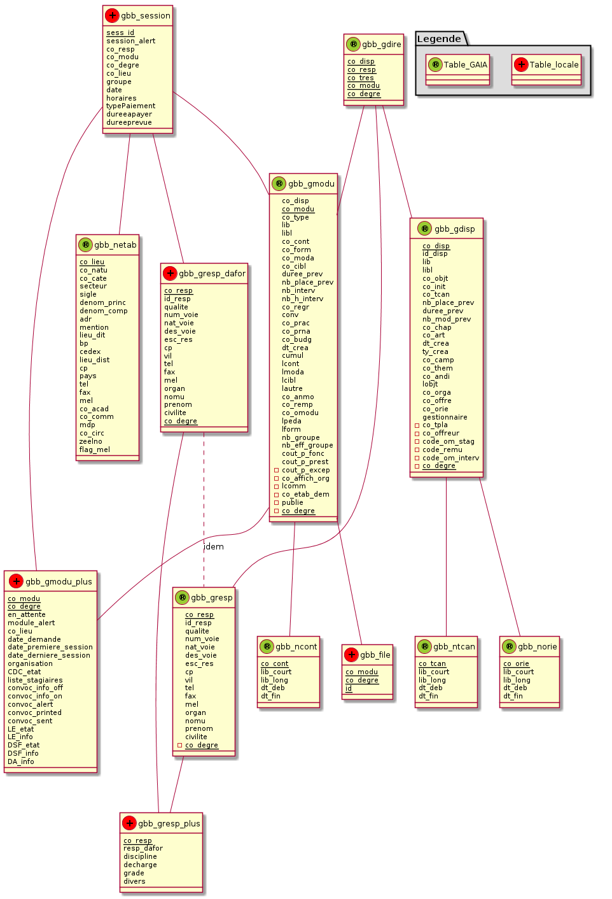

%GaiaBB
%Documentation Technique du module Drupal
%N. Poulain

<!-- Commande pour générer le pdf
file=README && java -jar ../../asciiArt/plantuml.jar $file.md && pandoc-1.9.1.2 --toc --number-sections --smart -s $file.md -o $file.pdf &&  evince $file.pdf
-->

Git
===

Ajout d'un nouveau fichier
--------------------------

Après ajout du nouveau fichier `FILE` dans le module gaiabb, on crée un lien
matériel vers dropbox puis on l'ajoute dans git.

`$ cd ~/Dropbox/gaiabb`
`$ ln /var/www/drupal-7.14/sites/default/modules/gaiabb/FILE FILE`
`$ git add FILE`

Commmiter des changements
-------------------------

le but est de créer un commit puis de 
tranférer vers http://code.google.com/p/npoulain/source/browse/

`$ git commit -a -m "Ajout du fichier FILE"` && git push google master`

Le module GaiaBB
================
Il est placé dans le dossier `sites/default/modules/`
de l'arborescence drupal.
Le dossier `sites/default/modules/gaiabb` contient notamment

* `gaiabb.info` (fichier de description du module)
* `gaiabb.module`

Scripts de mise à jour de la base de données
============================================

Le dossier unl_mysql contenu dans le dossier gaiabb
contient les scripts relatifs à la mise à jour de la base
de données :

`unl2sql.sh`
------------
  
Création du fichier `FILE.SQL` depuis `FILE.unl` possédant N champs. 
Le fichier est converti de UTF-8 vers ISO-8859-15 puis
nettoyé, les sauts de ligne sont supprimés. Le fichier SQL est créé.

`root@ks:# ./unl2sql FILE N`

`unlChecker.sh`
---------------

Verification de validité de FILE.unl et log des résultats. 
On vérifie que `CHAMPS_ATTENDUS = CHAMPS` et que `POIDS_MIN < POIDS`.

`root@ks:# ./unlChecker.sh FILE CHAMPS_ATTENDUS CHAMPS POIDS_MIN POIDS`

`GaiaBBupdateSQL.sh`
--------------------

C'est le script principal à lancer dans le cadre d'une mise à jour automatisée
par cron.
Il Lance la mise à jour des tables gaia lues par le module gaiaBB.
Lance aussi les  sauvegardes.

* `-n`  Nettoie en supprimant les fichiers .unl
* `-g`  Récupère par GET FTP les fichiers au format unl.
* `-m`  Lance le script unl2sql sur chacun des fichier unl afin de les traduire 
  en lignes d'injection SQL puis lance les injections

Voici un exemple d'utilisation et la sortie associée. 
On constate ici que la mise à jour de la table gmodu de GAIA a rencontré
un problème qui est analysé dans le rapport de sortie daté du jour : 
le poids du fichier est plus petit qu'attendu. 
Le fichier ETAT.log conserve la trace des rapports de sortie au format csv.

~~~
root@ks:# ./GaiaBBupdateSQL.sh -ngm
Usage: GaiaBBupdateSQL.sh [-n nettoyage] [-g getFPT] [-m mysqlInjections]
_N_etttoyage du dossier
_G_et FTP des donnees
.../sites/default/modules/gaiabb/unl_mysql/gdisp.unl:    6.49 MB    6.54 MB/s  
.../sites/default/modules/gaiabb/unl_mysql/gmodu.unl:   21.21 MB    4.71 MB/s  
.../sites/default/modules/gaiabb/unl_mysql/gdire.unl:  936.49 kB    8.74 MB/s  
.../sites/default/modules/gaiabb/unl_mysql/gresp.unl:  638.41 kB    8.07 MB/s  
.../sites/default/modules/gaiabb/unl_mysql/ncont.unl:    7.61 kB  415.51 kB/s  
.../sites/default/modules/gaiabb/unl_mysql/ntcan.unl:  185.00 B    28.91 kB/s  
.../sites/default/modules/gaiabb/unl_mysql/norie.unl:   25.53 kB  993.44 kB/s  
Injections _M_YSQL après amélioration des données
* gmodu.unl en traitement par unl2sql ...               fait.
                                                        ERROR
* gdisp.unl en traitement par unl2sql ...               fait.
* gdisp.SQL en cours d'injection  .....                 fait.

* gresp.unl en traitement par unl2sql ...               fait.
* gresp.SQL en cours d'injection  .....                 fait.

* gdire.unl en traitement par unl2sql ...               fait.
* gdire.SQL en cours d'injection  .....                 fait.

* ncont.unl en traitement par unl2sql ...               fait.
* ncont.SQL en cours d'injection  .....                 fait.

* ntcan.unl en traitement par unl2sql ...               fait.
* ntcan.SQL en cours d'injection  .....                 fait.

* norie.unl en traitement par unl2sql ...               fait.
* norie.SQL en cours d'injection  .....                 fait.

2012-06-10 18:21:14 ; gmodu ; Erreur ; Nb champs : 40 = 40 ; Poids : 37 < 5
2012-06-10 18:21:17 ; gdisp ; OK ; Nb champs : 29 = 29 ; Poids : 8000 < 8128
2012-06-10 18:21:26 ; gresp ; OK ; Nb champs : 18 = 18 ; Poids : 960 < 984
2012-06-10 18:21:30 ; gdire ; OK ; Nb champs : 6 = 6 ; Poids : 2650 < 2876
2012-06-10 18:21:45 ; ncont ; OK ; Nb champs : 6 = 6 ; Poids : 11 < 16
2012-06-10 18:21:45 ; ntcan ; OK ; Nb champs : 6 = 6 ; Poids : 3 < 4
2012-06-10 18:21:45 ; norie ; OK ; Nb champs : 6 = 6 ; Poids : 39 < 40
Il n'y a plus de paramètre
~~~

Tables ajoutées à la base de données drupal
===========================================

<!--
@startuml BDD.png

package "Legende" #DDDDDD {
  Table_locale << (+,Red) >>
  Table_GAIA << (®,YellowGreen) >>  
}

gbb_gmodu -- gbb_ncont
gbb_gmodu -- gbb_file
gbb_gmodu -- gbb_gmodu_plus
gbb_session -- gbb_gmodu
gbb_session -- gbb_gmodu_plus
gbb_session -- gbb_gresp_dafor
gbb_session -- gbb_netab

gbb_gresp_dafor .. gbb_gresp : idem
gbb_gresp_dafor -- gbb_gresp_plus
gbb_gresp -- gbb_gresp_plus

gbb_gdire -- gbb_gmodu
gbb_gdire -- gbb_gresp
gbb_gdire -- gbb_gdisp

gbb_gdisp -- gbb_norie
gbb_gdisp -- gbb_ntcan

gbb_gdire << (®,YellowGreen) >>
class gbb_gdire {
  {static} co_disp
  {static} co_resp
  {static} co_tres
  {static} co_modu
  {static} co_degre
}

gbb_gdisp << (®,YellowGreen) >>
class gbb_gdisp {
  {static} co_disp
  id_disp
  lib
  libl
  co_objt
  co_init
  co_tcan
  nb_place_prev
  duree_prev
  nb_mod_prev
  co_chap
  co_art
  dt_crea
  ty_crea
  co_camp
  co_them
  co_andi
  lobjt
  co_orga
  co_offre
  co_orie
  gestionnaire
  - co_tpla
  - co_offreur
  - code_om_stag
  - code_remu
  - code_om_interv
  - {static} co_degre
}

gbb_gmodu << (®,YellowGreen) >> 
class gbb_gmodu {
  co_disp
  {static} co_modu
  co_type
  lib
  libl
  co_cont
  co_form
  co_moda
  co_cibl
  duree_prev
  nb_place_prev
  nb_interv
  nb_h_interv
  co_regr
  conv
  co_prac
  co_prna
  co_budg
  dt_crea
  cumul
  lcont
  lmoda
  lcibl
  lautre
  co_anmo
  co_remp
  co_omodu
  lpeda
  lform
  nb_groupe
  nb_eff_groupe
  cout_p_fonc
  cout_p_prest
  -cout_p_excep
  -co_affich_org
  -lcomm
  -co_etab_dem
  -publie
  -{static} co_degre
}

gbb_gresp << (®,YellowGreen) >> 
class  gbb_gresp {
  {static} co_resp
  id_resp
  qualite
  num_voie
  nat_voie
  des_voie
  esc_res
  cp
  vil
  tel
  fax
  mel
  organ
  nomu
  prenom
  civilite
  -{static} co_degre
}

gbb_ncont << (®,YellowGreen) >>
class gbb_ncont {
  {static} co_cont
  lib_court
  lib_long
  dt_deb
  dt_fin
}

gbb_netab << (®,YellowGreen) >>
class gbb_netab{
  {static} co_lieu
  co_natu
  co_cate
  secteur
  sigle
  denom_princ
  denom_comp
  adr
  mention
  lieu_dit
  bp
  cedex
  lieu_dist
  cp
  pays
  tel
  fax
  mel
  co_acad
  co_comm
  mdp
  co_circ
  zeelno
  flag_mel
}

gbb_norie << (®,YellowGreen) >>
class gbb_norie {
  {static} co_orie
  lib_court
  lib_long
  dt_deb
  dt_fin
}

gbb_ntcan << (®,YellowGreen) >>
class gbb_ntcan {
  {static} co_tcan
  lib_court
  lib_long
  dt_deb
  dt_fin
}

gbb_session << (+,Red) >>
class gbb_session {
  {static} sess_id
  session_alert
  co_resp
  co_modu
  co_degre
  co_lieu
  groupe
  date
  horaires
  typePaiement
  dureeapayer
  dureeprevue
}

gbb_gresp_dafor << (+,Red) >> 
class  gbb_gresp_dafor {
  {static} co_resp
  id_resp
  qualite
  num_voie
  nat_voie
  des_voie
  esc_res
  cp
  vil
  tel
  fax
  mel
  organ
  nomu
  prenom
  civilite
  {static} co_degre
}

gbb_gmodu_plus << (+,Red) >>
class gbb_gmodu_plus {
  {static} co_modu
  {static} co_degre
  en_attente
  module_alert
  co_lieu
  date_demande
  date_premiere_session
  date_derniere_session
  organisation
  CDC_etat
  liste_stagiaires
  convoc_info_off
  convoc_info_on
  convoc_alert
  convoc_printed
  convoc_sent
  LE_etat
  LE_info
  DSF_etat
  DSF_info
  DA_info
}

gbb_file << (+,Red) >>
class gbb_file {
  {static} co_modu
  {static} co_degre
  {static} id
}

gbb_gresp_plus << (+,Red) >>
class gbb_gresp_plus {
  {static} co_resp
  resp_dafor
  discipline
  decharge
  grade
  divers
}
@enduml
-->

Notes :

~~~
CREATE table zzzz as SELECT
 id 'co_resp',
 id 'id_resp',
 NULL 'qualite',
 NULL 'num_voie',
 NULL 'nat_voie',
 NULL 'des_voie',
 NULL 'esc_res',
 NULL 'cp',
 NULL 'vil',
 tel_fixe 'tel',
 NULL 'fax',
 mail 'mel',
 NULL 'org',
 CONCAT(SUBSTRING(formateur,1,LOCATE('-',formateur)-1),SUBSTRING(formateur,1,LOCATE(' ',formateur)-1)) 'nomu',
 SUBSTRING(SUBSTRING(formateur,LOCATE('-',formateur)+1),LOCATE(' ',SUBSTRING(formateur,LOCATE('-',formateur)+1))+1) 'prenom',
 NULL 'civilite',
 NULL 'co_degre'
from gbb_gresp_dafor
~~~i

tables

TABLE_NAME  	COLUMN_NAME	    DATA_TYPE	Max	Null    Key	Default	Comment
----------      ------------    ---------   --- ----    --- ------- --------
gbb_file    	co_modu	        int	        NULL	NO		0   	Code du module pour un dispositif donné
gbb_file    	co_degre	    smallint	NULL	NO		2	    Code du degré
gbb_file    	fid	            smallint	NULL	NO		NULL	Clé étrangère avec table file_managed
gbb_gdire   	co_disp	        int     	NULL	NO	PRI	NULL	Code interne du dispositif
gbb_gdire   	co_resp	        int	        NULL	NO	PRI	NULL	Code responsable
gbb_gdire   	co_tres	        char	    1   	NO	PRI	NULL	code du type de responsable
gbb_gdire   	co_modu	        int	        NULL	NO	PRI	0	    Code du module pour un dispositif donné
gbb_gdire   	co_degre	    smallint	NULL	NO	PRI	2	    Code du degré
gbb_gdisp   	co_disp	        int	        NULL	NO	PRI	NULL	Code interne du dispositif
gbb_gdisp   	id_disp	        char	    10  	NO	MUL	NULL	Identifiant du dispositif
gbb_gdisp   	lib	            char	    50  	YES		NULL	Libellé
gbb_gdisp   	libl	        char	    250 	YES		NULL	Libellé long
gbb_gdisp   	co_objt	        char	    2   	YES		NULL	Code de l objectif de formation
gbb_gdisp   	co_init	        char	    2   	YES		NULL	Code du niveau d initiative
gbb_gdisp   	co_tcan	        char	    1   	YES		NULL	Code du type de candidature
gbb_gdisp   	nb_place_prev	smallint	NULL	YES		NULL	Nombre de places prévues
gbb_gdisp   	duree_prev	    smallint	NULL	YES		NULL	Durée moyenne estimée par personne
gbb_gdisp   	nb_mod_prev	    smallint	NULL	YES		NULL	Nombre de modules prévus
gbb_gdisp   	co_chap	        char	    4   	YES		NULL	Code du chapitre de prévision
gbb_gdisp   	co_art	        char	    2   	YES		NULL	Code article de prévision
gbb_gdisp   	dt_crea	        date	    NULL	YES		NULL	date de création
gbb_gdisp   	ty_crea	        char	    1   	YES		NULL	Type de création
gbb_gdisp   	co_camp	        char	    2   	YES		NULL	Code de la campagne
gbb_gdisp   	co_them	        char	    2   	YES		NULL	Code du thème du dispositif
gbb_gdisp   	co_andi	        char	    2   	YES		NULL	Code du type d annulation du dispositif
gbb_gdisp   	lobjt	        text        65535	YES		NULL	Objectif littéral
gbb_gdisp   	co_orga	        int	        NULL	YES		NULL	Code de l organisme
gbb_gdisp   	co_offre	    int	        NULL	YES		NULL	Code interne de l offre
gbb_gdisp   	co_orie	        char	    4   	YES		NULL	Code nomenclature locale d orientation créé dans la table NORIE de gaia
gbb_gdisp   	gestionnaire	char	    50  	YES		NULL	Gestionnaire en charge du dispositif
gbb_gdisp   	co_tpla	        char	    1   	YES		NULL	Code type de plan
gbb_gdisp   	co_offreur	    char	    8   	YES		NULL	Code offreur
gbb_gdisp   	code_om_stag	char    	2   	YES		NULL	Code du modèle choisi pour l OM stagiaire
gbb_gdisp   	code_remu	    char	    2   	YES		NULL	code du modèle choisi pour la fiche de rémunération
gbb_gdisp   	code_om_interv	char	    2   	YES		NULL	code du modèle choisi pou l OM intervenant
gbb_gdisp   	co_degre	    smallint	NULL	NO	PRI	2	    Code du degré
gbb_gmodu   	co_disp	        int	        NULL	NO	MUL NULL	Code interne du dispositif
gbb_gmodu   	co_modu	        int	        NULL	NO	PRI	NULL	Code du module pour un dispositif donné
gbb_gmodu   	co_type	        char	    1   	YES		NULL	type du module
gbb_gmodu   	lib	            char	    50  	YES		NULL	Libellé
gbb_gmodu   	libl	        char    	150 	YES		NULL	Libellé long
gbb_gmodu   	co_cont	        char	    3   	YES		NULL	Code contenu
gbb_gmodu   	co_form	        char	    1   	YES		NULL	Code forme
gbb_gmodu   	co_moda	        char    	1   	YES		NULL	Code modalité
gbb_gmodu   	co_cibl	        char    	2   	YES		NULL	Code du public cible
gbb_gmodu   	duree_prev	    smallint	NULL	YES		NULL	Durée moyenne estimée par personne
gbb_gmodu   	nb_place_prev	smallint	NULL	YES		NULL	Nombre de places prévues
gbb_gmodu   	nb_interv	    smallint	NULL	YES		NULL	Nombre d intervenant
gbb_gmodu   	nb_h_interv	    smallint	NULL	YES		NULL	Nombre d heures d intervention
gbb_gmodu   	co_regr	        char    	6   	YES		NULL	Code regroupement
gbb_gmodu   	conv	        char    	1   	YES		NULL	Flag convention ? O/N
gbb_gmodu   	co_prac	        char    	2   	YES		NULL	Code priorité académique
gbb_gmodu   	co_prna	        char    	2   	YES		NULL	Code priorité nationale
gbb_gmodu   	co_budg	        char    	3	    YES		NULL	Code budget
gbb_gmodu   	dt_crea	        date	    NULL	YES		NULL	date de création
gbb_gmodu   	cumul	        char	    1   	YES		NULL	cumul pour le 1 degré si plus 36 semaines
gbb_gmodu   	lcont	        text    	65535	YES		NULL	Contenu littéral
gbb_gmodu   	lmoda	        text	    65535	YES		NULL	modalité littérale
gbb_gmodu   	lcibl	        text    	65535	YES		NULL	Cible littérale
gbb_gmodu   	lautre	        text	    65535	YES		NULL	Autre zone littérale
gbb_gmodu   	co_anmo	        char    	2   	YES		NULL	Code du type d annulation des modules
gbb_gmodu   	co_remp	        char	    1   	YES		NULL	code de remplacement 1er degré
gbb_gmodu   	co_omodu	    int	        NULL	YES		NULL	code du module de l offre
gbb_gmodu   	lpeda	        char	    250 	YES     NULL	Descriptif de l objectif pédagogique
gbb_gmodu   	lform	        char	    250	    YES		NULL	Description littérale de la forme
gbb_gmodu   	nb_groupe	    smallint	NULL	YES		NULL	Nombre de groupes possible
gbb_gmodu   	nb_eff_groupe	smallint	NULL	YES		NULL	Effectif par groupe
gbb_gmodu   	cout_p_fonc	    decimal	    NULL	YES		NULL	cout prévisionnel de fonctionnement par groupe
gbb_gmodu   	cout_p_prest	decimal	    NULL	YES		NULL	cout prévisionnel de prestation par groupe
gbb_gmodu   	cout_p_excep	decimal	    NULL	YES		NULL	cout prévisionnel des frais exceptionnels
gbb_gmodu   	co_affich_org	char    	1   	NO		NULL	Code affichage des organisations prévisionnelles - \narborescence plan (O/N)
gbb_gmodu   	lcomm	        char    	250 	YES		NULL	Commentaires
gbb_gmodu   	co_etab_dem	    char	    8   	YES		NULL	Code de l établissement demandeur
gbb_gmodu   	publie	        char    	1   	YES		NULL	Publication des demandes
gbb_gmodu   	co_degre	    smallint	NULL	NO	PRI	2	    Code du degré
gbb_gmodu_plus	co_modu	        int	        NULL	NO	PRI	NULL	Code du module pour un dispositif donné
gbb_gmodu_plus	co_degre	    smallint	NULL	NO  PRI	2	    Code du degré
gbb_gmodu_plus	module_alert	tinyint	    NULL	YES		0   	Alerte sur le module : le service administratif est prévenu d un changement important.
gbb_gmodu_plus	prioritaire	    tinyint	    NULL	YES		0   	Prioritaire
gbb_gmodu_plus	module_printed	tinyint	    NULL	YES		0   	L ensemble des convocations a été imprimé.
gbb_gmodu_plus	organisation	text    	65535	YES		NULL	Journal de bord
gbb_gmodu_plus	CDC_etat	    tinyint	    NULL	YES		0	    Le CDC a-t-il été transmis au CE ?
gbb_gmodu_plus	convoc_info_off	text	    65535	YES		NULL	Info à ne pas porter sur la convocation 
gbb_gmodu_plus	convoc_info_on	text    	65535	YES		NULL	Info à porter sur la convocation 
gbb_gmodu_plus	LE_etat	        tinyint	    NULL	YES		0	    Listes d émargement transmises
gbb_gmodu_plus	LE_info	        text	    65535	YES		NULL	Infos à propos des listes d émargement
gbb_gmodu_plus	DSF_etat	    tinyint 	NULL	YES		0	    Déclaration de Service Fait transmises
gbb_gmodu_plus	DSF_info	    text    	65535	YES		NULL	Infos à propos des Déclaration de Service Fait 
gbb_gmodu_plus	DA_info	        text	    65535	YES		NULL	Infos à propos du Dossier Administratif
gbb_gmodu_plus	DA_date_depot	datetime	NULL	NO		1970-01-01 00:00:00	Date de dépot du dossier administratif
gbb_gresp   	co_resp	        int 	    NULL	NO	PRI	NULL	Code responsable
gbb_gresp   	id_resp	        char    	5   	YES		NULL	Identifiant du responsable
gbb_gresp   	qualite	        char    	60  	YES		NULL	Qualité du responsable (fonction)
gbb_gresp   	num_voie	    char	    4   	YES		NULL	Numéro de la voie
gbb_gresp   	nat_voie	    char	    4   	YES		NULL	Nature de la voie
gbb_gresp   	des_voie	    char	    20  	YES		NULL	adresse
gbb_gresp   	esc_res	        char	    30  	YES		NULL	escalier - résidence
gbb_gresp   	cp	            char	    5   	YES		NULL	code postal
gbb_gresp   	vil	            char	    30  	YES		NULL	Ville
gbb_gresp   	tel	            char	    14  	YES		NULL	Téléphone
gbb_gresp   	fax	            char	    14  	YES		NULL	fax
gbb_gresp   	mel	            char	    60  	YES		NULL	@mail
gbb_gresp   	organ	        char	    60  	YES		NULL	Organisme
gbb_gresp   	nomu	        char	    20  	YES		NULL	Nom d usage
gbb_gresp   	prenom	        char	    15  	YES		NULL	Prénom de la personne
gbb_gresp   	civilite	    char	    1   	YES		NULL	Civilité
gbb_gresp   	co_degre	    smallint	NULL	NO	PRI	2	    Code du degré
gbb_gresp_dafor	co_resp	        int	        NULL	NO	PRI	NULL	Code responsable
gbb_gresp_dafor	id_resp	        char	    5   	YES		NULL	Identifiant du responsable
gbb_gresp_dafor	qualite	        char	    60  	YES		NULL	Qualité du responsable (fonction)
gbb_gresp_dafor	num_voie	    char	    4   	YES		NULL	Numéro de la voie
gbb_gresp_dafor	nat_voie	    char	    4   	YES		NULL	Nature de la voie
gbb_gresp_dafor	des_voie	    char	    20  	YES		NULL	adresse
gbb_gresp_dafor	esc_res	        char	    30  	YES		NULL	escalier - résidence
gbb_gresp_dafor	cp	            char	    5   	YES		NULL	code postal
gbb_gresp_dafor	vil	            char	    30  	YES		NULL	Ville
gbb_gresp_dafor	tel	            char	    14  	YES		NULL	Téléphone
gbb_gresp_dafor	fax         	char	    14  	YES		NULL	fax
gbb_gresp_dafor	mel	            char	    60  	YES		NULL	@mail
gbb_gresp_dafor	organ	        char    	60  	YES		NULL	Organisme
gbb_gresp_dafor	nomu	        char	    20  	YES		NULL	Nom d usage
gbb_gresp_dafor	prenom	        char    	15  	YES		NULL	Prénom de la personne
gbb_gresp_dafor	civilite	    char	    1   	YES		NULL	Civilité
gbb_gresp_dafor	co_degre	    smallint	NULL	NO	PRI	2	    Code du degré
gbb_gresp_plus	co_resp	        int	        NULL	NO	PRI	NULL	Code responsable
gbb_gresp_plus	resp_dafor	    varchar	    10  	NO  	NULL	Initiales du conseiller responsable
gbb_gresp_plus	discipline	    varchar	    100	    NO		NULL	Discipline
gbb_gresp_plus	decharge	    decimal	    NULL	NO		0.0	    Nombre d heures de décharge
gbb_gresp_plus	grade	        varchar	    100	    NO		NULL	Certifié, agrégé,...
gbb_gresp_plus	divers	        varchar	    1000	NO		NULL	Infos diverses
gbb_ncont   	co_cont	        char    	3   	NO	PRI	NULL	Code contenu
gbb_ncont   	lib_court	    char    	10  	YES 	NULL	Libellé court
gbb_ncont   	lib_long	    char	    50	    YES		NULL	Libellé long
gbb_ncont   	dt_deb	        date	    NULL	YES		NULL	Date de début
gbb_ncont   	dt_fin	        date	    NULL  	YES		NULL	Date de fin
gbb_netab   	co_lieu	        char    	8   	NO	PRI	NULL	Code lieu
gbb_netab   	co_natu	        char	    3   	YES		NULL	Code nature
gbb_netab   	co_cate	        char	    4   	YES		NULL	Code catégorie
gbb_netab   	secteur	        char	    2   	YES		NULL	Secteur
gbb_netab   	sigle	        char    	6   	YES		NULL	Sigle de l établissement
gbb_netab   	denom_princ	    char    	30  	YES		NULL	Dénomination principale
gbb_netab   	denom_comp	    char    	30  	YES		NULL	Dénomination complémentaire
gbb_netab   	adr	            char    	200 	YES		NULL	Adresse
gbb_netab   	mention	        char	    32  	YES		NULL	Mention
gbb_netab   	lieu_dit	    char	    24  	YES		NULL	Lieu-dit
gbb_netab   	bp	            char    	7   	YES		NULL	Bureau Postal
gbb_netab   	cedex	        char	    2   	YES		NULL	Cedex
gbb_netab   	lieu_dist	    char	    26  	YES		NULL	Bureau distributeur
gbb_netab   	cp	            char    	5   	YES		NULL	code postal
gbb_netab   	pays	        char	    32  	YES		NULL	Pays
gbb_netab   	tel	            char	    14  	YES		NULL	Téléphone
gbb_netab   	fax	            char	    14  	YES		NULL	fax
gbb_netab   	mel	            char	    60  	YES		NULL	@mail
gbb_netab   	co_acad	        char    	3   	YES		NULL	Code de l académie
gbb_netab   	co_comm	        char	    6   	YES		NULL	Code commune
gbb_netab   	mdp	            char	    8   	YES		NULL	Mot de passe
gbb_netab   	co_circ	        char    	8   	YES		NULL	Code circonscription
gbb_netab   	zeelno	        char	    5   	YES		NULL	Numéro de zone élémentaire
gbb_netab   	flag_mel	    char	    1   	YES		NULL	Flag pour envois des Ordres de Mission -OM- par \nmail (O/N)
gbb_netab_dafor	co_lieu	        char    	8   	NO	PRI	NULL	Code lieu
gbb_netab_dafor	co_natu	        char	    3   	YES		NULL	Code nature
gbb_netab_dafor	co_cate	        char    	4   	YES		NULL	Code catégorie
gbb_netab_dafor	secteur	        char	    2   	YES		NULL	Secteur
gbb_netab_dafor	sigle	        char        6   	YES		NULL	Sigle de l établissement
gbb_netab_dafor	denom_princ	    char    	30  	YES		NULL	Dénomination principale
gbb_netab_dafor	denom_comp	    char	    30  	YES		NULL	Dénomination complémentaire
gbb_netab_dafor	adr	            char    	200 	YES		NULL	Adresse
gbb_netab_dafor	mention	        char    	32  	YES		NULL	Mention
gbb_netab_dafor	lieu_dit	    char    	24  	YES		NULL	Lieu-dit
gbb_netab_dafor	bp	            char	    7   	YES		NULL	Bureau Postal
gbb_netab_dafor	cedex	        char    	2   	YES		NULL	Cedex
gbb_netab_dafor	lieu_dist	    char	    26  	YES		NULL	Bureau distributeur
gbb_netab_dafor	cp	            char	    5   	YES		NULL	code postal
gbb_netab_dafor	pays	        char	    3   	YES		NULL	Pays
gbb_netab_dafor	tel	            char	    14  	YES		NULL	Téléphone
gbb_netab_dafor	fax	            char	    14  	YES		NULL	fax
gbb_netab_dafor	mel	            char	    60  	YES		NULL	@mail
gbb_netab_dafor	co_acad	        char    	3   	YES		NULL	Code de l académie
gbb_netab_dafor	co_comm	        char	    6   	YES		NULL	Code commune
gbb_netab_dafor	mdp	            char    	8   	YES		NULL	Mot de passe
gbb_netab_dafor	co_circ	        char	    8   	YES		NULL	Code circonscription
gbb_netab_dafor	zeelno	        char    	5   	YES		NULL	Numéro de zone élémentaire
gbb_netab_dafor	flag_mel    	char	    1   	YES		NULL	Flag pour envois des Ordres de Mission -OM- par \nmail (O/N)
gbb_norie   	co_orie     	char    	4   	NO	PRI	NULL	Code nomenclature locale d orientation créé dans la  table NORIE de gaia
gbb_norie   	lib_court	    char	    10  	YES		NULL	Libellé court
gbb_norie   	lib_long	    char    	50	    YES		NULL	Libellé long
gbb_norie   	dt_deb      	date	    NULL	YES		NULL	Date de début
gbb_norie   	dt_fin      	date	    NULL	YES		NULL	Date de fin
gbb_ntcan   	co_tcan	        char	    1	    NO	PRI	NULL	Code du type de candidature
gbb_ntcan   	lib_court   	char	    10	    YES		NULL	Libellé court
gbb_ntcan   	lib_long    	char	    50	    YES		NULL	Libellé long
gbb_ntcan   	dt_deb	        date	    NULL	YES		NULL	Date de début
gbb_ntcan   	dt_fin      	date	    NULL	YES		NULL	Date de fin
gbb_session 	sess_id     	smallint	NULL	NO	PRI	NULL	Identifiant de la session
gbb_session 	session_alert	tinyint 	NULL	YES		0   	Alerte sur la session, le service administratif est prévenu d un changement important. 0/1
gbb_session 	en_attente	    tinyint 	NULL	YES		0	    O:stage en attente, ne pas préparer la convocation pour cette session- 1:Demande de prépartion de la convocation pour cette session
gbb_session 	convoc_sent 	tinyint 	NULL	YES		0	    La convocation pour cette session a été envoyée. 0/1
gbb_session 	co_resp     	int	        NULL	NO	MUL	NULL	Code responsable
gbb_session 	co_modu     	int	        NULL	NO	MUL	NULL	Code du module pour un dispositif donné
gbb_session 	co_degre    	smallint	NULL	NO		2	    Code du degré
gbb_session 	co_lieu 	    char	    8	    NO		NULL	Code lieu
gbb_session 	groupe  	    tinyint	    NULL	YES		1	    Numéro du groupe
gbb_session 	date        	date	    NULL	YES	MUL	NULL	Date de la session format YYYY-MM-DD
gbb_session 	date_ts     	timestamp	NULL	YES	MUL	NULL	Date de la session format nb de secondes depuis 01/01/1970
gbb_session 	horaires	    varchar	    50	    YES		0	    Horaires de la session
gbb_session 	type_paiement	varchar	    8   	YES		VAC	    type de paiement du formateur
gbb_session 	duree_a_payer	decimal	    NULL	YES		0.00	Nombre d heures à payer
gbb_session 	duree_prevue	decimal	    NULL	YES		0.00	Nombre d heures prévues
gbb_session 	uid         	int 	    NULL	NO		NULL	User uid du responsable de la dernière modif
gbb_session 	date_modif  	datetime	NULL	NO		NULL	Date de dernière modification
