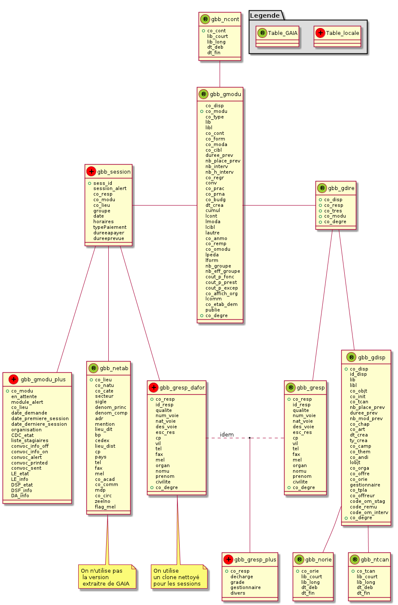

%GaiaBB
%Documentation Technique du module Drupal
%N. Poulain

<!-- Commande pour générer le pdf
file=README.md && java -jar ../../asciiArt/plantuml.jar $file.md && pandoc-1.9.1.2 --toc --number-sections --smart -s $file.md -o $file.pdf &&  evince $file.pdf
-->

Le module GaiaBB
================

TODO : décrire les buts du module.

Il est placé dans le dossier `sites/default/modules/`
de l'arborescence drupal.
Le dossier `sites/default/modules/gaiabb` contient notamment

* `gaiabb.info` (fichier de description du module)
* `gaiabb.module`

Scripts de mise à jour de la base de données
============================================

Le dossier unl_mysql contenu dans le dossier gaiabb
contient les scripts relatifs à la mise à jour de la base
de données :

`GaiaBBupdateSQL.sh`
--------------------

Lance la mise à jour des tables gaia lues par le module gaiaBB. 
Lance aussi les  sauvegardes.

`root@ks:# GaiaBBupdateSQL.sh -gam...`

* `-g`  Récupère par GET FTP les fichiers au format unl.
* `-a`  Lance le script unl2sql sur chacun des fichier unl afin de les traduire 
  en lignes d'injection SQL.
* `-m` lance les injections SQL.

`unl2sql.sh`
------------
  
Création du fichier `FILE.SQL` depuis `FILE.unl` possédant N champs. 
Le fichier est converti de UTF-8 vers ISO-8859-15 puis
nettoyé, les sauts de ligne sont supprimés. Le fichier SQL est créé.

`root@ks:# unl2sql FILE N`

`unlChecker.sh`
---------------

Verification de validité de FILE.unl et log des résultats. 
On vérifie que `CHAMPS_ATTENDUS = CHAMPS` et que `POIDS_MIN < POIDS`.

`root@ks:# unlChecker.sh FILE CHAMPS_ATTENDUS CHAMPS POIDS_MIN POIDS`

Tables ajoutées à la base de données drupal
===========================================

<!--
@startuml BDD.png

package "Legende" #DDDDDD {
  Table_locale << (+,Red) >>
  Table_GAIA << (®,YellowGreen) >>  
}

gbb_gmodu -up- gbb_ncont
gbb_session -right- gbb_gmodu
gbb_session -- gbb_gmodu_plus
gbb_gresp_dafor -down- gbb_session
gbb_gresp_dafor .right. gbb_gresp : idem
(gbb_gresp_dafor, gbb_gresp) -- gbb_gresp_plus
gbb_gdire -right- gbb_gmodu
gbb_gdire -- gbb_gresp
gbb_gdire -down- gbb_gdisp
gbb_session -- gbb_netab
gbb_gdisp -- gbb_norie
gbb_gdisp -- gbb_ntcan

gbb_gdire << (®,YellowGreen) >>
class gbb_gdire {
  +co_disp
  +co_resp
  +co_tres
  +co_modu
  +co_degre
}

gbb_gdisp << (®,YellowGreen) >>
class gbb_gdisp {
  +co_disp
  id_disp
  lib
  libl
  co_objt
  co_init
  co_tcan
  nb_place_prev
  duree_prev
  nb_mod_prev
  co_chap
  co_art
  dt_crea
  ty_crea
  co_camp
  co_them
  co_andi
  lobjt
  co_orga
  co_offre
  co_orie
  gestionnaire
  co_tpla
  co_offreur
  code_om_stag
  code_remu
  code_om_interv
  +co_degre
}

gbb_gmodu << (®,YellowGreen) >> 
class gbb_gmodu {
  co_disp
  +co_modu
  co_type
  lib
  libl
  co_cont
  co_form
  co_moda
  co_cibl
  duree_prev
  nb_place_prev
  nb_interv
  nb_h_interv
  co_regr
  conv
  co_prac
  co_prna
  co_budg
  dt_crea
  cumul
  lcont
  lmoda
  lcibl
  lautre
  co_anmo
  co_remp
  co_omodu
  lpeda
  lform
  nb_groupe
  nb_eff_groupe
  cout_p_fonc
  cout_p_prest
  cout_p_excep
  co_affich_org
  lcomm
  co_etab_dem
  publie
  +co_degre
}

gbb_gresp << (®,YellowGreen) >> 
class  gbb_gresp {
  +co_resp
  id_resp
  qualite
  num_voie
  nat_voie
  des_voie
  esc_res
  cp
  vil
  tel
  fax
  mel
  organ
  nomu
  prenom
  civilite
  +co_degre
}

gbb_ncont << (®,YellowGreen) >>
class gbb_ncont {
  +co_cont
  lib_court
  lib_long
  dt_deb
  dt_fin
}

gbb_netab << (®,YellowGreen) >>
class gbb_netab {
  +co_lieu
  co_natu
  co_cate
  secteur
  sigle
  denom_princ
  denom_comp
  adr
  mention
  lieu_dit
  bp
  cedex
  lieu_dist
  cp
  pays
  tel
  fax
  mel
  co_acad
  co_comm
  mdp
  co_circ
  zeelno
  flag_mel
}
note bottom of gbb_netab : On n'utilise pas\n la version\n extraitre de GAIA

gbb_norie << (®,YellowGreen) >>
class gbb_norie {
  +co_orie
  lib_court
  lib_long
  dt_deb
  dt_fin
}

gbb_ntcan << (®,YellowGreen) >>
class gbb_ntcan {
  +co_tcan
  lib_court
  lib_long
  dt_deb
  dt_fin
}

gbb_session << (+,Red) >>
class gbb_session {
  +sess_id
  session_alert
  co_resp
  co_modu
  co_lieu
  groupe
  date
  horaires
  typePaiement
  dureeapayer
  dureeprevue
}

gbb_gresp_dafor << (+,Red) >> 
class  gbb_gresp_dafor {
  +co_resp
  id_resp
  qualite
  num_voie
  nat_voie
  des_voie
  esc_res
  cp
  vil
  tel
  fax
  mel
  organ
  nomu
  prenom
  civilite
  +co_degre
}
note bottom of gbb_gresp_dafor : On utilise \nun clone nettoyé\npour les sessions

gbb_gmodu_plus << (+,Red) >>
class gbb_gmodu_plus {
  +co_modu
  en_attente
  module_alert
  co_lieu
  date_demande
  date_premiere_session
  date_derniere_session
  organisation
  CDC_etat
  liste_stagiaires
  convoc_info_off
  convoc_info_on
  convoc_alert
  convoc_printed
  convoc_sent
  LE_etat
  LE_info
  DSF_etat
  DSF_info
  DA_info
}

gbb_gresp_plus << (+,Red) >>
class gbb_gresp_plus {
  +co_resp
  resp_dafor
  discipline
  decharge
  grade
  divers
}
@enduml
-->

Notes :

~~~
CREATE table zzzz as SELECT
 id 'co_resp',
 id 'id_resp',
 NULL 'qualite',
 NULL 'num_voie',
 NULL 'nat_voie',
 NULL 'des_voie',
 NULL 'esc_res',
 NULL 'cp',
 NULL 'vil',
 tel_fixe 'tel',
 NULL 'fax',
 mail 'mel',
 NULL 'org',
 CONCAT(SUBSTRING(formateur,1,LOCATE('-',formateur)-1),SUBSTRING(formateur,1,LOCATE(' ',formateur)-1)) 'nomu',
 SUBSTRING(SUBSTRING(formateur,LOCATE('-',formateur)+1),LOCATE(' ',SUBSTRING(formateur,LOCATE('-',formateur)+1))+1) 'prenom',
 NULL 'civilite',
 NULL 'co_degre'
from gbb_gresp_dafor
~~~
